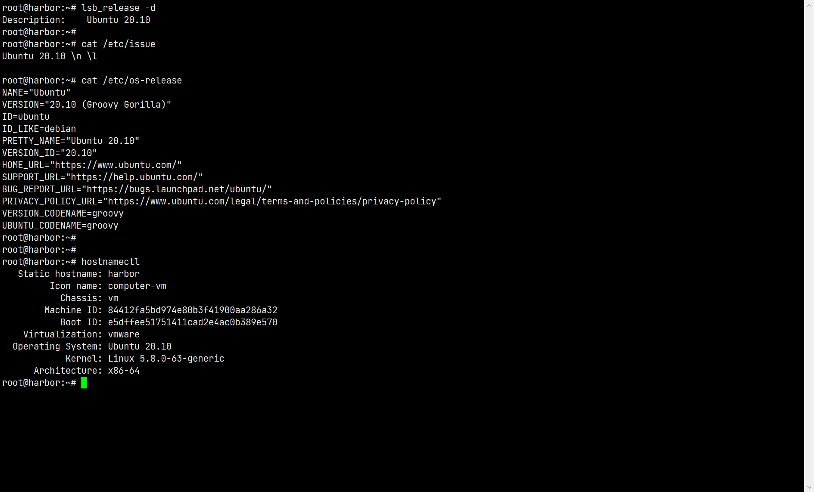
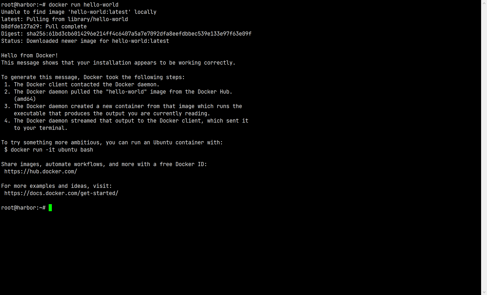

# Docker 使用相关

## [Docker 安装](https://docs.docker.com/engine/install/ubuntu/)

### 当前环境



### 删除原有的 docker（没有也不影响）

> `docker`、 `docker.io` 或者 `docker-engine` 都是之前的官方称呼，已经过时，当前分为两个版本：
> `docker-ce`：社区版
> `docker-ee`：企业版

```shell
apt remove docker docker-engine docker.io containerd runc
```

### 设置 Docker 仓库

1. 更新软件列表

   ```shell
   apt update
   apt install apt-transport-https ca-certificates curl gnupg lsb-release
   ```

2. 添加 Docker 官方 GPG

   ```shell
    curl -fsSL https://download.docker.com/linux/ubuntu/gpg | sudo gpg --dearmor -o /usr/share/keyrings/docker-archive-keyring.gpg
   ```

3. 设置 stable 版本仓库
   ```shell
    echo \
   "deb [arch=amd64 signed-by=/usr/share/keyrings/docker-archive-keyring.gpg] https://download.docker.com/linux/ubuntu \
   $(lsb_release -cs) stable" | sudo tee /etc/apt/sources.list.d/docker.list > /dev/null
   ```

### 安装 Docker Engin

1. 更新 apt 列表

   ```shell
    apt update
   ```

2. 安装最新版本（或者跳到下一步安装指定版本）

   ```shell
   apt install docker-ce docker-ce-cli containerd.io
   ```

3. 安装指定版本 docker

   - 列出可使用的版本列表

   ```shell
   apt-cache madison docker-ce
   # docker-ce | 5:20.10.8~3-0~ubuntu-groovy | https://download.docker.com/linux/ubuntu groovy/stable amd64 Packages
   # docker-ce | 5:20.10.7~3-0~ubuntu-groovy | https://download.docker.com/linux/ubuntu groovy/stable amd64 Packages
   # docker-ce | 5:20.10.6~3-0~ubuntu-groovy | https://download.docker.com/linux/ubuntu groovy/stable amd64 Packages
   # docker-ce | 5:20.10.5~3-0~ubuntu-groovy | https://download.docker.com/linux/ubuntu groovy/stable amd64 Packages
   # docker-ce | 5:20.10.4~3-0~ubuntu-groovy | https://download.docker.com/linux/ubuntu groovy/stable amd64 Packages
   # docker-ce | 5:20.10.3~3-0~ubuntu-groovy | https://download.docker.com/linux/ubuntu groovy/stable amd64 Packages
   # docker-ce | 5:20.10.2~3-0~ubuntu-groovy | https://download.docker.com/linux/ubuntu groovy/stable amd64 Packages
   # docker-ce | 5:20.10.1~3-0~ubuntu-groovy | https://download.docker.com/linux/ubuntu groovy/stable amd64 Packages
   # docker-ce | 5:20.10.0~3-0~ubuntu-groovy | https://download.docker.com/linux/ubuntu groovy/stable amd64 Packages
   ```

   - 比方说要安装 `docker-ce | 5:20.10.4~3-0~ubuntu-groovy` 版本

   ```shell
   apt install docker-ce=<5:20.10.4~3-0~ubuntu-groovy> docker-ce-cli=<5:20.10.4~3-0~ubuntu-groovy> containerd.io
   ```

4. 验证安装是否成功

   ```shell
    docker run hello-world
   ```

   

## [配置 Docker 镜像仓库为阿里云](https://cr.console.aliyun.com/cn-hangzhou/instances/mirrors)

1. 修改配置文件

   ```shell
     ls /etc/docker
     # 如果不存在 /etc/docker 则创建
     # mkdir -p /etc/docker
     tee /etc/docker/daemon.json <<-'EOF'
     {
       "registry-mirrors": ["https://自己申请的阿里镜像加速地址"]
     }
     EOF
   ```

2. 重新加载 docker 配置并重启 docker 服务

   ```shell
   systemctl daemon-reload
   systemctl restart docker
   ```

3. 重新拉取一个镜像试试

   ```shell
   docker pull nginx
   ```

## Docker 相关的常用操作

### Ubuntu 中防火墙相关操作

1. 查看防火墙状态

   ```shell
    ufw status
    # Status: active 表示开启
    # Status: inactive 表示关闭
   ```

2. 关闭防火墙

   ```shell
    ufw disable
   ```

3. 开启防火墙

   ```shell
    ufw enable
   ```

4. 查看特定端口状态（例如 22）（State 列值 为 LISTEN）则外部可以访问

   ```shell
    netstat -tunlp | grep 22
   ```

5. 开启特定端口的访问并重启防火墙

   ```shell
    ufw allow 2375/tcp
    ufw reload
   ```

6. 关闭端口（防火墙活跃的前提下）

   ```shell
    ufw delete allow 2375/tcp
   ```

### Docker 常用命令

1. 从镜像仓库中拉取或者更新指定镜像

   ```shell
    docker pull [OPTIONS] NAME[:TAG|@DIGEST]
    # 从Docker Hub下载 busybox 最新版镜像
    docker pull busybox
   ```

2. 列出本地镜像

   ```shell
    docker images [OPTIONS] [REPOSITORY[:TAG]]
    # 查看本地镜像列表
    docker images
   ```

3. 删除本地一个或多个镜像

   ```shell
    docker rmi [OPTIONS] IMAGE [IMAGE...]
    # 强制删除本地镜像 busybox:latest
    docker rmi -f busybox:latest
   ```

4. 将指定镜像保存成 tar 归档文件

   ```shell
    docker save [OPTIONS] IMAGE [IMAGE...]
    # busybox:latest 生成 my_busybox.tar 文档
    # 默认保存在操作时所在目录（pwd）中
    docker save -o my_busybox.tar busybox:latest
   ```

5. 导入使用 docker save 命令导出的镜像

   ```shell
    docker load [OPTIONS]
    # 导入 my_busybox.tar 为本地镜像
    docker load -i my_busybox.tar
   ```

6. 创建一个新的容器并运行一个命令

   ```shell
    docker run [OPTIONS] IMAGE [COMMAND] [ARG...]
    # 使用docker镜像nginx:latest以后台模式启动一个容器,将容器 80 端口映射到宿主机 8080 端口，
    # 并将容器命名为 mynginx
    docker run --name mynginx -d -p 8080:80 nginx:latest
    curl localhost:8080
   ```

7. 列出容器

   ```shell
    docker ps [OPTIONS]
    # 列出所有在运行的容器信息
    docker ps
    # 列出所有在运行的和已经停止的容器信息
    docker ps -a
   ```

8. 停止一个运行中的容器

   ```shell
    docker stop [OPTIONS] CONTAINER [CONTAINER...]
    # 停止正在运行的 mynginx
    docker stop mynginx
   ```

9. 启动一个或多个已经被停止的容器
   ```shell
   docker start [OPTIONS] CONTAINER [CONTAINER...]
   # 启动已经被停止的容器 mynginx
   docker start mynginx
   ```
10. 重启容器

    ```shell
      docker restart [OPTIONS] CONTAINER [CONTAINER...]
      # 重启容器 mynginx
      docker restart mynginx
    ```

11. 获取容器的日志

    ```shell
      docker logs [OPTIONS] CONTAINER
      # 跟踪查看容器 mynginx 的日志输出
      docker logs -f mynginx
    ```

12. 在运行的容器中执行命令
    ```shell
      docker exec [OPTIONS] CONTAINER COMMAND [ARG...]
      # 在容器 mynginx 中开启一个交互模式的终端
      docker exec -it  mynginx /bin/bash
      # 进入容器后，终端输入 exit 退出
    ```
13. 登陆到一个 Docker 镜像仓库，如果未指定镜像仓库地址，默认为官方仓库 Docker Hub

    ```shell
      docker login [OPTIONS] [SERVER]
      # 登陆到Docker Hub
      docker login -u 用户名 -p 密码
    ```

14. 登出一个 Docker 镜像仓库，如果未指定镜像仓库地址，默认为官方仓库 Docker Hub
    ```shell
      docker logout [OPTIONS] [SERVER]
      # 登出Docker Hub
      docker logout
    ```

### 一些便捷操作

1. 指定 docker ps 的格式
   ```shell
    # 完整格式
    docker ps --format "table {{.ID}}\t{{.Image}}\t{{.Command}}\t{{.CreatedAt}}\t{{.RunningFor}}\t{{.Ports}}\t{{.Status}}\t{{.Size}}\t{{.Names}}\t{{.Labels}}\t{{.Mounts}}\t{{.Networks}}"
    # 默认格式
    docker ps
    # 省略显示
    docker ps --format "table {{.ID}}\t{{.Image}}\t{{.Ports}}\t{{.Status}}\t{{.Names}}\t{{.Networks}}"
    # 也可以用于 -a
    docker ps -a --format "table {{.ID}}\t{{.Image}}\t{{.Ports}}\t{{.Status}}\t{{.Names}}\t{{.Networks}}"
   ```
2. 停止所有正在运行的容器
   ```shell
    docker stop $(docker ps -q)
   ```
3. 删除所有已经停止的容器（利用不加 -f 不能删除正在运行的容器）
   ```shell
    docker rm $(docker ps -a -q)
   ```
4. 停止所有名字包含 nginx 的容器（容器名字即 run 时候 --name 时的值）
   ```shell
    docker stop $(docker ps -q -f "name=nginx")
   ```
5. 删除所有镜像

   ```shell
    docker rmi $(docker images -q)
    docker rmi -f $(docker images -q)
   ```

6. 清理没用到的镜像
   ```shell
    docker image prune
    -a, --all # 删除所有没有用的镜像，而不仅仅是临时文件
    -f, --force #强制删除镜像文件，无需弹出提示确认
   ```
