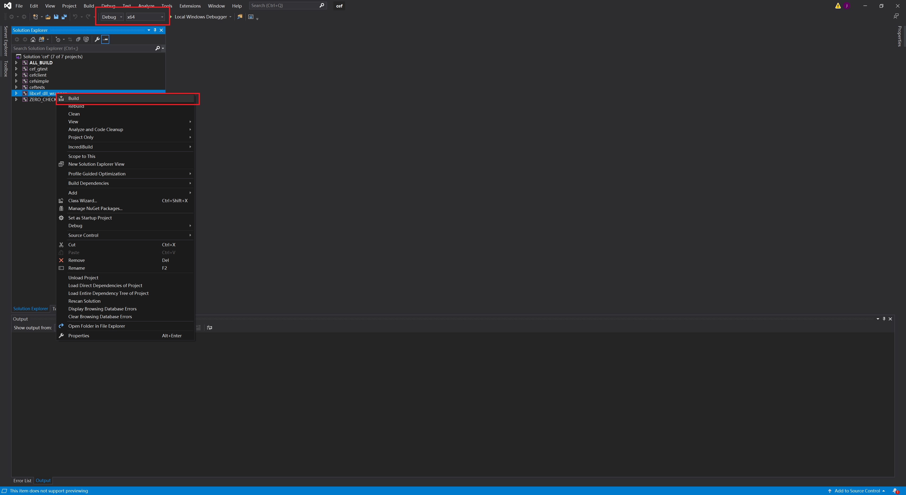
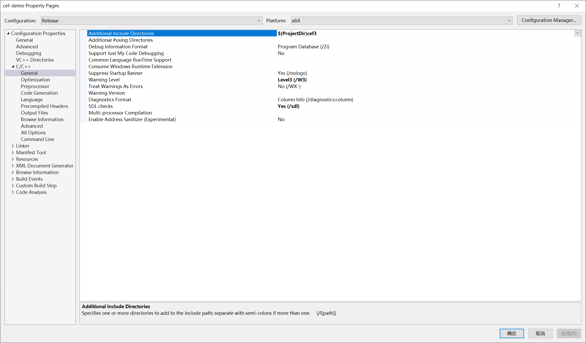

# Win10 下搭建 CEF3 开发环境

## [CEF3 Sharp](https://github.com/cefsharp/CefSharp)

CefSharp 环境的搭建比较简单，直接参考上面的官方文档就可以搭建出来，这里就不详细介绍了。

## Cef  C++ 环境搭建

## [参考文章一](https://zhuanlan.zhihu.com/p/344306287)，[以及二](https://zhuanlan.zhihu.com/p/346779059)

## [chromiumembedded/cef 官方 GitHub](https://github.com/chromiumembedded/cef)

## [编译库文件]

为简单起见，我们不从源码开始编译，而是使用官方编译好的各个平台的二进制发布文件，在此基础上只需要编译必要的静态库即可（主要就是 `libcef_dll_wrapper.lib` 这个静态库文件）。

1. [下载二进制颁布文件](https://cef-builds.spotifycdn.com/index.html)

   > 这里使用 `cef_binary_90.6.7+g19ba721+chromium-90.0.4430.212_windows64` 版本

   

2. 下载完毕后解压文件并在解压出来的根目录下创建 `build` 文件夹以便存放编译后的文件。

   

3. 使用[cmake-3.18.3-win64-x64](来编译)

   - 设置完源文件目录和编译目录后点击 `Configure` 按钮。
     
   - 选择电脑上安装的 `Visual Studio`，默认编译目标平台 `x64`，人后点击 `Finish` 按钮。
     
   - 等待日志输出 `Configuring done` 之后，点击 `Generate` 按钮。
     
   - 日志输出 `Generating done` 后表示编译已经完成，可关闭 `CMake` 了。
     

4. 打开编译后目录中的 `cef.sln`
   
   

   - **ALL_BUILD** 与 **ZERO_CHECK**：是 cmake 自动生成的辅助工程。
   - **cef_gtest** 与 **ceftests**：都是测试模块,这里不关心。
   - **cefclient**：一个包含 CEF 各种 API 演示的浏览器程序 Demo。
   - **cefsimple**：一个简单的 CEF 浏览器程序 Demo。
   - **libcef_dll_wrapper**：对 libcef 库的 C++代码封装。上述 cefclient 与 cefsimple 都会用它。

5. 编译 `libcef_dll_wrapper`

   - 编译前
     
   - 编译 `Debug` 版本
     
     
   - 编译 `Release` 版本
     
   - 编译完成后
     

6. 编译官方示例工程（编译前先将源码中默认网页地址 `http://www.google.com` 改为 `http://www.baidu.com`）否则打开后无法加载页面（除非有梯子。。。）

   
   
   
   

7. 编译 `cefsimple`（`Debug`和`Release`都编译一遍）

   - 编译前
     
     
     
   - 编译后
     

8. 同样方法编译 `cefclient`（`Debug`和`Release`都编译一遍）

   - 编译后
     

9. 打开 `cefsimple`
   
   
   
   

10. 打开 `cefclient`
    
    
    
    

## 将库文件引入到自己的项目中

### 收集需要用的文件

1. 新建一个文件夹 `cef3` 来存放各种必须的文件（分为 `Debug` 和 `Release`）
   

   > 目录结构为：

   ```txt
   cef3:
   ├─include
   │  │  cef_accessibility_handler.h
   │  │  ...
   │  │
   │  ├─base
   │  │  │  cef_atomicops.h
   │  │  │  ...
   │  │  │
   │  │  └─internal
   │  │          cef_atomicops_arm64_msvc.h
   │  │          ...
   │  │
   │  ├─capi
   │  │  │  cef_accessibility_handler_capi.h
   │  │  │  ...
   │  │  │
   │  │  ├─test
   │  │  │      cef_test_helpers_capi.h
   │  │  │      cef_translator_test_capi.h
   │  │  │
   │  │  └─views
   │  │          cef_box_layout_capi.h
   │  │          ...
   │  │
   │  ├─internal
   │  │      cef_export.h
   │  │      ...
   │  │
   │  ├─test
   │  │      cef_test_helpers.h
   │  │      cef_translator_test.h
   │  │
   │  ├─views
   │  │      cef_box_layout.h
   │  │      ...
   │  │
   │  └─wrapper
   │          cef_byte_read_handler.h
   │          ...
   │
   ├─lib
   │  ├─Debug
   │  │      cef_sandbox.lib
   │  │      libcef.lib
   │  │      libcef_dll_wrapper.lib
   │  │      libcef_dll_wrapper.pdb
   │  │
   │  └─Release
   │          cef_sandbox.lib
   │          libcef.lib
   │          libcef_dll_wrapper.lib
   │
   ├─Debug
   │  │  chrome_elf.dll
   │  │  d3dcompiler_47.dll
   │  │  ...
   │  │
   │  └─swiftshader
   │          libEGL.dll
   │          libGLESv2.dll
   ├─Release
   │  │  chrome_elf.dll
   │  │  d3dcompiler_47.dll
   │  │  libcef.dll
   │  │  libEGL.dll
   │  │  libGLESv2.dll
   │  │  snapshot_blob.bin
   │  │  v8_context_snapshot.bin
   │  │
   │  └─swiftshader
   │          libEGL.dll
   │          libGLESv2.dll
   │
   └─Resources
    │  chrome_100_percent.pak
    │  chrome_200_percent.pak
    │  icudtl.dat
    │  resources.pak
    │
    └─locales
            am.pak
            ...
   ```

2. `cef3/include` 来源于 `cef_binary_90.6.7+g19ba721+chromium-90.0.4430.212_windows64/include`
   

3. `cef3/Debug` 和 `cef3/Release` 来源于 `cef_binary_90.6.7+g19ba721+chromium-90.0.4430.212_windows64/Debug|Release`（但是都去除 `cef_sandbox.lib` 和 `libcef.lib` 两个文件）
   

4. `cef3/Resources` 来源于 `cef_binary_90.6.7+g19ba721+chromium-90.0.4430.212_windows64/Resources`
   

5. `cef3/lib/Debug|Release` 来源于 `cef_binary_90.6.7+g19ba721+chromium-90.0.4430.212_windows64/build/libcef_dll_wrapper/Debug|Release`（同时加上`cef_binary_90.6.7+g19ba721+chromium-90.0.4430.212_windows64/Debug|Release` 中的 `cef_sandbox.lib` 和 `libcef.lib` 两个文件）
   

### 将收集的文件引入到自己的项目中

1. 用 `Visual Studio 2019` 创建一个默认的 `Windows Desktop Application` `cef-demo`
   
   

2. 将之前收集的文件夹 `cef3` 整个复制到 `cef-demo` 目录下
   

#### 配置依赖（Debug）环境

1. 打开属性设置
   

2. `C/C++ —> General —? Additional Include Directories` 设置为 `$(ProjectDir)cef3`
   
   

3. `Linker —> Input —> Additional Dependencies` 添加依赖库

   ```txt
    $(ProjectDir)cef3\lib\Debug\libcef.lib
    $(ProjectDir)cef3\lib\Debug\cef_sandbox.lib
    $(ProjectDir)cef3\lib\Debug\libcef_dll_wrapper.lib
   ```

   
   
   

4. `C/C++ —> Code Generation —> Runtime Library` 从 `MDd` 改为 `MTd`
   

5. `C/C++ -> Preprocessor -> Preprocessor Definitions` 添加 `_ITERATOR_DEBUG_LEVEL=0` 否则编译时报错。

   ```txt
    Severity	Code	Description	Project	File	Line	Suppression State
   Error	LNK2038	mismatch detected for '_ITERATOR_DEBUG_LEVEL': value '0' doesn't match value '2'
   ```

   
   
   

6. `Build Events -> Post-Build Event -> Command Line` 添加拷贝资源的命令
   ```cmd
     xcopy /e /r /y  "$(ProjectDir)cef3\Debug" "$(OutDir)"
     xcopy /e /r /y  "$(ProjectDir)cef3\Resources" "$(OutDir)"
   ```
   
   
   

#### 配置依赖（Release）环境

基本上与 `Debug` 的配置一样，只是一方面将对应的 `Debug` 替换成 `Release`，另一方面，将 `C/C++ —> Code Generation —> Runtime Library` 从 `MDd` 改为 `MT`，同时，`Release` 环境下不需要添加 `_ITERATOR_DEBUG_LEVEL=0`。

    
    
    
    

#### 编写代码

1. 为方便起见，这里直接使用官方提供的 `cefsimple` 的代码，直接将其中的 `.h` 和 `.cc` 文件添加到 `cef-demo` 项目中。
   

2. 将原来代码中引用 `tests/cefsimple/` 修改为直接引用，例如
   ```c++
   #include "tests/cefsimple/simple_app.h"
   // 改为
   #include "simple_app.h"
   ```
3. 添加 `cef-demo.manifest` 文件（`$(ProjectDir)cef-demo.manifest`）

   ```xml
     <?xml version="1.0" encoding="UTF-8" standalone="yes"?>
     <assembly xmlns="urn:schemas-microsoft-com:asm.v1" manifestVersion="1.0">
       <compatibility xmlns="urn:schemas-microsoft-com:compatibility.v1">
         <application>
           <!--The ID below indicates application support for Windows Vista -->
           <supportedOS Id="{e2011457-1546-43c5-a5fe-008deee3d3f0}"/>
           <!--The ID below indicates application support for Windows 7 -->
           <supportedOS Id="{35138b9a-5d96-4fbd-8e2d-a2440225f93a}"/>
           <!--The ID below indicates application support for Windows 8 -->
           <supportedOS Id="{4a2f28e3-53b9-4441-ba9c-d69d4a4a6e38}"/>
           <!--The ID below indicates application support for Windows 8.1 -->
           <supportedOS Id="{1f676c76-80e1-4239-95bb-83d0f6d0da78}"/>
           <!--The ID below indicates application support for Windows 10 -->
           <supportedOS Id="{8e0f7a12-bfb3-4fe8-b9a5-48fd50a15a9a}"/>
         </application>
       </compatibility>
     </assembly>
   ```

   
   
   
   
   
   
   

4. 编译项目

   - 编译前
     
   - 编译后
     
     
     

5. 打开 `Debug` 程序
   

6. 打开 `Release` 程序
   

## 至此集成 `CEF3 C++` 完成。
