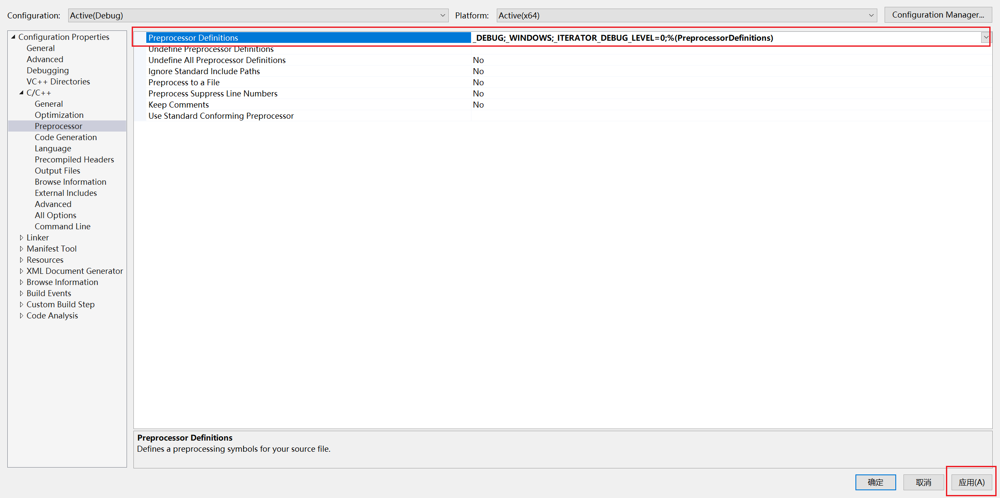
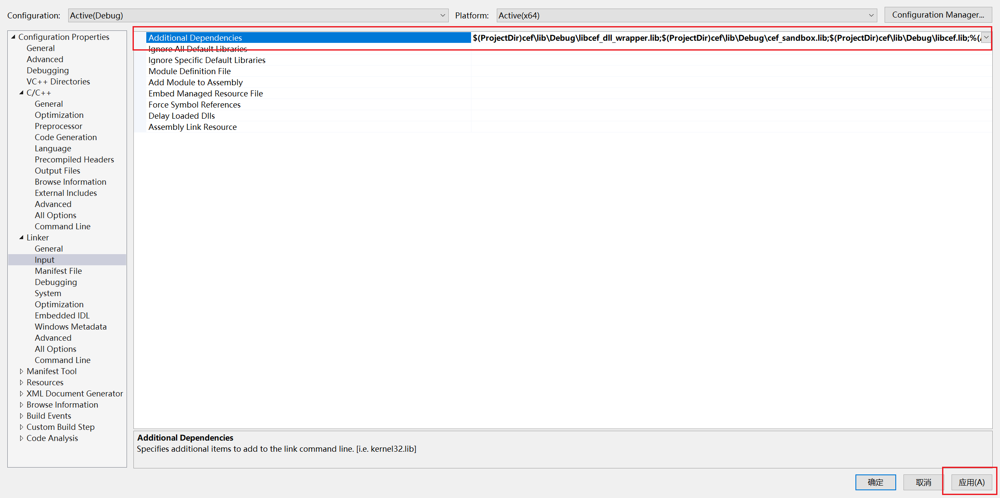

# Win10 CEF C++ 环境

## 基础环境

1. 系统
   - `Windows 10 21H1`
     
2. [CEF](https://cef-builds.spotifycdn.com/index.html#windows64)
   - `cef_binary_98.1.19+g57be9e2+chromium-98.0.4758.80_windows64.tar.bz2`
     
3. [CMake](https://cmake.org/download/)

   - `cmake-3.22.2-windows-x86_64`
     

4. Visual Studio
   - `Visual Studio Enterprise 2019`
     

## 编译 CEF

1. 在 CEF 的解压文件夹中创建`build`文件夹，以便存放编译结果
   

2. 使用 CMake 编译 CEF

- 打开`cmake-gui`
  

- 设置`Where is the sourcce code` 和`Where to build the binaries` 然后点击`Configure`
  

- 设置编译工具`Visual Studio 16 2019`，编译平台`x64`
  
  

- 等待出现`Configuring done`之后点击`Generate`按钮
  
- 等待出现`Generating done` 之后代表编译完成，关闭`CMake`窗口
  
  

## 编译官方示例项目

1. 利用`Visual Studio` 打开编译后目录`build`下的`cef.sln`文件
   
   

   - **ALL_BUILD** 与 **ZERO_CHECK**：是 `CMake` 自动生成的辅助工程。
   - **cef_gtest** 与 **ceftests**：都是测试模块,这里不关心。
   - **cefclient**：一个包含 `CEF` 各种 `API` 演示的浏览器程序 `Demo`。
   - **cefsimple**：一个简单的 `CEF` 浏览器程序 `Demo`。
   - **libcef_dll_wrapper**：对 `libcef` 库的 `C++`代码封装。上述 `cefclient` 与 `cefsimple` 都会用它。

2. 编译`libcef_dll_wrapper`库

   - 编译`Debug`版本
     
     

   - 编译`Release`版本
     
     

   - 编译完成后
     
     
     

3. 编译官方示例工程（编译前先将源码中默认网页地址 `http://www.google.com` 改为 `http://www.baidu.com`）否则打开后无法加载页面（除非有梯子……）
   

   - 编译 `cefsimple`（`Debug`和`Release`都编译一遍）
     
     
     
     
     

   - 同样方法编译 `cefclient`（`Debug`和`Release`都编译一遍）
     

4. 打开测试工程

   - 打开 `cefsimple`工程
     
     

   - 打开 `cefclient`工程
     
     

## 创建自定义初始项目

### 收集必要的文件

1. 新建文件夹`cef`（具体所在位置无关紧要）
   

2. 目录结构

   ```txt
   cef:
   ├─include
   │  │  cef_accessibility_handler.h
   │  │  ...
   │  │
   │  ├─base
   │  │  │  cef_atomicops.h
   │  │  │  ...
   │  │  │
   │  │  └─internal
   │  │          cef_atomicops_arm64_msvc.h
   │  │          ...
   │  │
   │  ├─capi
   │  │  │  cef_accessibility_handler_capi.h
   │  │  │  ...
   │  │  │
   │  │  ├─test
   │  │  │      cef_test_helpers_capi.h
   │  │  │      cef_translator_test_capi.h
   │  │  │
   │  │  └─views
   │  │          cef_box_layout_capi.h
   │  │          ...
   │  │
   │  ├─internal
   │  │      cef_export.h
   │  │      ...
   │  │
   │  ├─test
   │  │      cef_test_helpers.h
   │  │      cef_translator_test.h
   │  │
   │  ├─views
   │  │      cef_box_layout.h
   │  │      ...
   │  │
   │  └─wrapper
   │          cef_byte_read_handler.h
   │          ...
   │
   ├─lib
   │  ├─Debug
   │  │      cef_sandbox.lib
   │  │      libcef.lib
   │  │      libcef_dll_wrapper.lib
   │  │      libcef_dll_wrapper.pdb
   │  │
   │  └─Release
   │          cef_sandbox.lib
   │          libcef.lib
   │          libcef_dll_wrapper.lib
   │
   ├─Debug
   │  │  chrome_elf.dll
   │  │  d3dcompiler_47.dll
   │  │  ...
   │  │
   │  └─swiftshader
   │          libEGL.dll
   │          libGLESv2.dll
   ├─Release
   │  │  chrome_elf.dll
   │  │  d3dcompiler_47.dll
   │  │  libcef.dll
   │  │  libEGL.dll
   │  │  libGLESv2.dll
   │  │  snapshot_blob.bin
   │  │  v8_context_snapshot.bin
   │  │
   │  └─swiftshader
   │          libEGL.dll
   │          libGLESv2.dll
   │
   └─Resources
       │  chrome_100_percent.pak
       │  chrome_200_percent.pak
       │  icudtl.dat
       │  resources.pak
       │
       └─locales
               am.pak
               ...
   ```

3. `cef/include` 完整来源于`cef_binary_98.1.19+g57be9e2+chromium-98.0.4758.80_windows64/include`
   

4. `cef/Debug` 和 `cef/Release` 来源于 `cef_binary_98.1.19+g57be9e2+chromium-98.0.4758.80_windows64/Debug|Release`但是去除了`cef_sandbox.lib`和`libcef.lib`
   
   
   
   
   

5. `cef/Resources` 完整来源于 `cef_binary_98.1.19+g57be9e2+chromium-98.0.4758.80_windows64/Resources`
   

6. `cef/lib/Debug|Release` 来源于 `cef_binary_98.1.19+g57be9e2+chromium-98.0.4758.80_windows64/build/libcef_dll_wrapper/Debug|Release`（同时加上`cef_binary_98.1.19+g57be9e2+chromium-98.0.4758.80_windows64/Debug|Release` 中的 `cef_sandbox.lib 和 libcef.lib` 两个文件）
   
   
   

### 将`cef`引入到自己的项目中

1. 用 `Visual Studio 2019` 创建一个默认的 `Windows Desktop Application` `simple_app`
   
   
   

2. 将`cef`文件夹完整复制到`simple_app`目录下
   
   

#### 配置`Debug`环境

1. 打开属性设置
   

2. `C/C++ --> General --> Additional Include Directories` 设置为 `$(ProjectDir)cef`
   

3. `C/C++ --> Preprocessor --> Preprocessor Definitions` 添加 `_ITERATOR_DEBUG_LEVEL=0` 否则编译时报错
   
   

4. `C/C++ --> Code Generation --> Runtime Library` 从 `MDd` 改为 `MTd`
   

5. `Linker --> Input --> Additional Dependencies` 添加依赖库

   ```txt
       $(ProjectDir)cef\lib\Debug\libcef_dll_wrapper.lib
      $(ProjectDir)cef\lib\Debug\cef_sandbox.lib
      $(ProjectDir)cef\lib\Debug\libcef.lib
   ```

   
   
   

6. `Build Events --> Post-Build Event --> Command Line` 添加拷贝资源的命令

   ```txt
      xcopy /e /r /y  "$(ProjectDir)cef\Debug" "$(OutDir)"
      xcopy /e /r /y  "$(ProjectDir)cef\Resources" "$(OutDir)"
   ```

   
   
   

7. 创建`simple_app.manifest`清单文件并加入项目，`simple_app.manifest`文件内容：

   ```xml
      <?xml version="1.0" encoding="UTF-8" standalone="yes"?>
      <assembly xmlns="urn:schemas-microsoft-com:asm.v1" manifestVersion="1.0">
         <compatibility xmlns="urn:schemas-microsoft-com:compatibility.v1">
            <application>
                  <!--The ID below indicates application support for Windows Vista -->
                  <supportedOS Id="{e2011457-1546-43c5-a5fe-008deee3d3f0}"/>
                  <!--The ID below indicates application support for Windows 7 -->
                  <supportedOS Id="{35138b9a-5d96-4fbd-8e2d-a2440225f93a}"/>
                  <!--The ID below indicates application support for Windows 8 -->
                  <supportedOS Id="{4a2f28e3-53b9-4441-ba9c-d69d4a4a6e38}"/>
                  <!--The ID below indicates application support for Windows 8.1 -->
                  <supportedOS Id="{1f676c76-80e1-4239-95bb-83d0f6d0da78}"/>
                  <!--The ID below indicates application support for Windows 10 -->
                  <supportedOS Id="{8e0f7a12-bfb3-4fe8-b9a5-48fd50a15a9a}"/>
            </application>
         </compatibility>
      </assembly>
   ```

   
   
   

8. 打开属性设置`Manifet Tools --> Input and Output --> Additional Manifet Files` 设置为`$(ProjectDir)simple_app.manifest`

   

#### 配置依赖`Release`环境

> 基本上与 `Debug` 的配置一样，只是一方面将对应的 Debug 替换成 `Release`，另一方面，将 `C/C++ --> Code Generation --> Runtime Library` 从 `MDd` 改为 `MT`，同时，`Release` 环境下不需要添加 `_ITERATOR_DEBUG_LEVEL=0`


### 编写自己项目的代码

1. 将`cef_binary_98.1.19+g57be9e2+chromium-98.0.4758.80_windows64\tests\cefsimple`下`simple_app.h`中内容完全复制到自己新建项目的`simple_app.h`中，将`simple_app.cc`中内容完整复制到自己新建项目的`simple_app.cpp`中并修改引入头文件的错误

   
   

2. 创建`simple_handler.h`和`simple_handler.cpp`文件，分别将`cef_binary_98.1.19+g57be9e2+chromium-98.0.4758.80_windows64\tests\cefsimple`下的`simple_handler.h`和`simple_handler.cc`文件中的内容复制到对应的文件内并修改对应的头文件引入错误

   
   

3. 创建`simple_handler_win.cpp`文件并将`cef_binary_98.1.19+g57be9e2+chromium-98.0.4758.80_windows64\tests\cefsimple`下的`simple_handler_win.cc`中的内容复制到里面并修改头文件引入错误

   

4. 创建`main_win.cpp`文件并将`cef_binary_98.1.19+g57be9e2+chromium-98.0.4758.80_windows64\tests\cefsimple`下的`cefsimple_win.cc`中的内容复制到里面并修改头文件引入错误

   

## 编译自己创建的新项目

### 编译`Debug`版本

   
   

### 编译`Release`版本

   
   

### 打开`Debug`版本

   
   

### 打开`Release`版本

   
   

