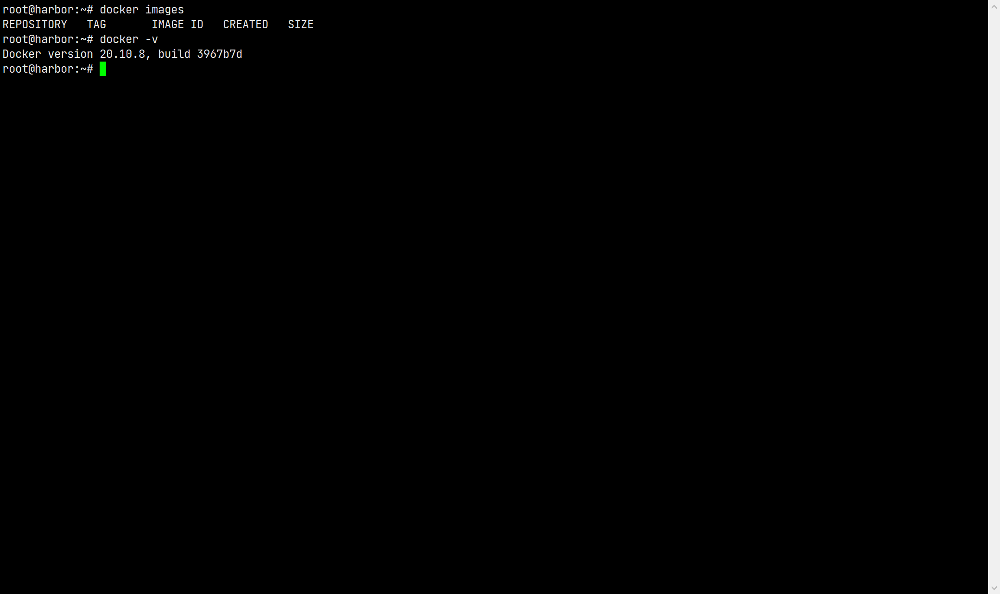
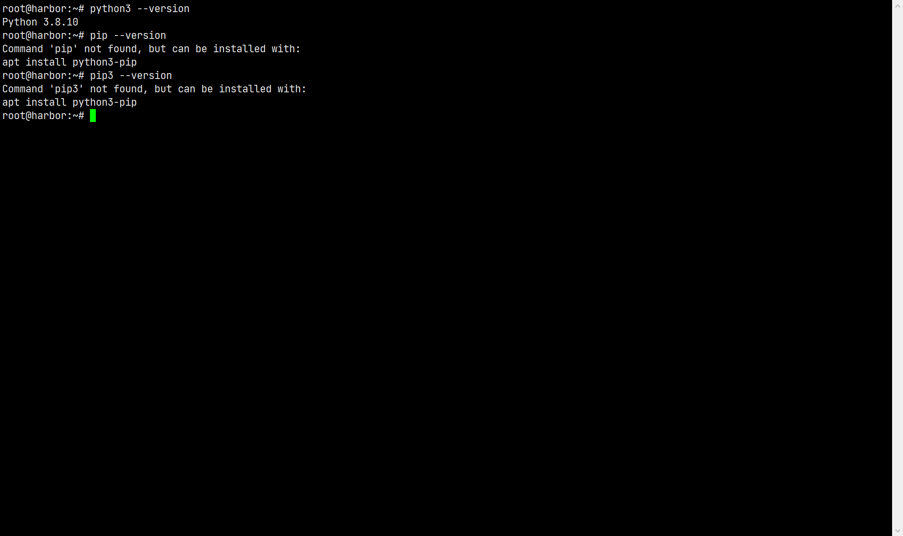

# Docker-Compose 使用

## [安装](https://docs.docker.com/compose/install/)

### 前提自然是已经安装完 Docker



### 安装

#### 直接安装

1. 下载 Docker Compose

   ```shell
   # 这里安装的是 1.29.2 版本，如果需要安装其它版本，修改这个版本号即可
    curl -L "https://github.com/docker/compose/releases/download/1.29.2/docker-compose-$(uname -s)-$(uname -m)" -o /usr/local/bin/docker-compose
   ```

2. 修改 `docker-compose` 权限，添加可执行权限

   ```shell
    chmod +x /usr/local/bin/docker-compose
   ```

3. 查看是否安装成功
   ```shell
    docker-compose --version
    # docker-compose version 1.29.2, build 5becea4c
   ```

#### 如果上述方法无法安装，也可以使用 pip 来安装

1. 安装 pip（ubuntu 默认以安装了 python3，但是没有安装 pip）
   

   ```shell
   apt update
   apt install python3-pip
   pip --version
   ```

2. 利用 pip 安装 docker-compose
   ```shell
       pip install docker-compose
   ```
3. 查看是否安装成功
   ```shell
    docker-compose --version
   ```
