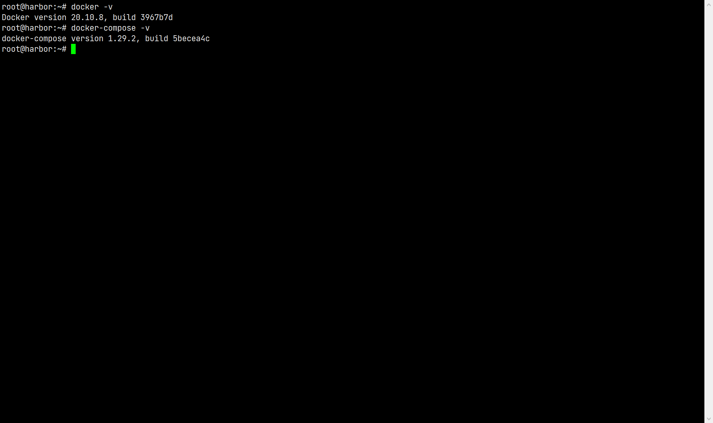
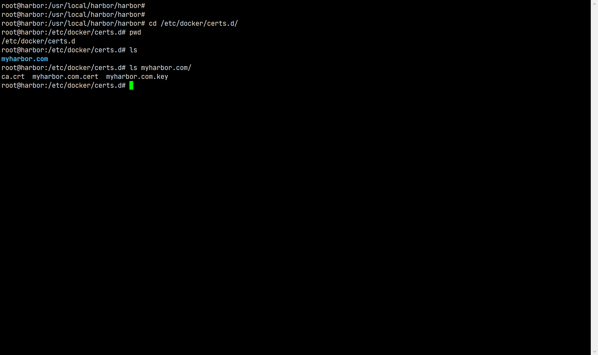
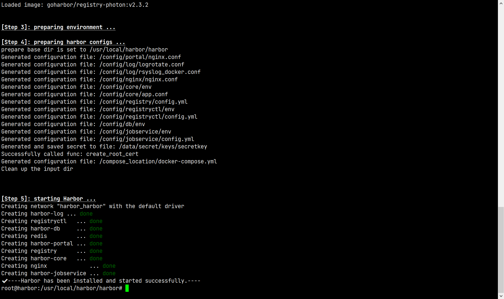
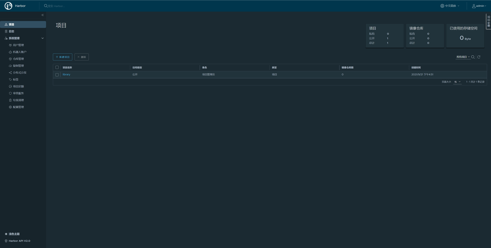
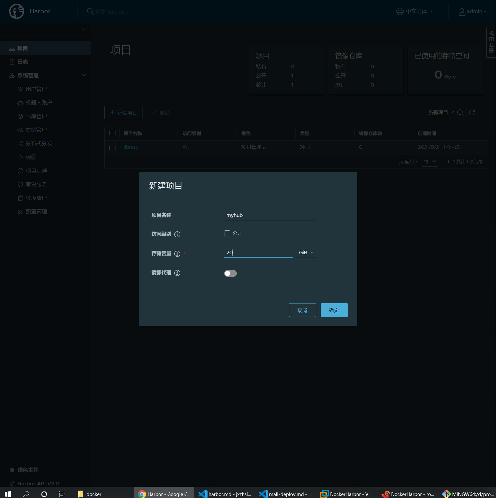
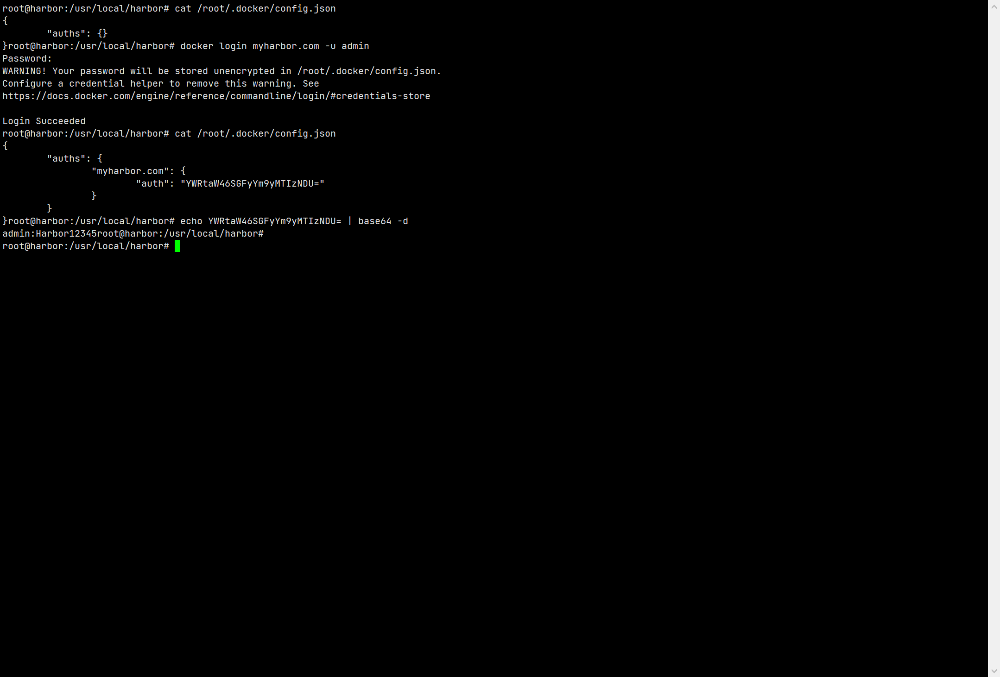
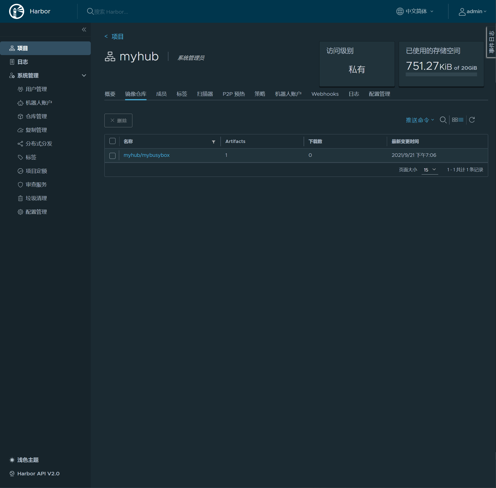

# 使用 Harbor 搭建私有 Docker 仓库

## [下载与安装](https://goharbor.io/docs/2.3.0/install-config/)

### 前提是事先安装了 docker 与 docker-compose



### 生成 SSL 证书

1. 修改 `hosts` 文件

   ```shell
    vim /etc/hosts
    # 添加
    192.168.220.100 myharbor.com
    # 重启
    reboot
   ```

2. 修改 docker 配置文件

   ```shell
    vim /etc/docker/daemon.json
    # 添加
    "registry-mirrors": ["https://阿里云加速地址","https://myharbor.com"]
    # 重启 docker 服务
    systemctl daemon-reload
    systemctl restart docker
   ```

3. 生成 `Certificate Authority Certificate`（CA 证书）

   - 生成 CA 证书私钥

     ```shell
       openssl genrsa -out ca.key 4096
     ```

   - 生成 CA 证书

     ```shell
       openssl req -x509 -new -nodes -sha512 -days 3650 \
       -subj "/C=CN/ST=Beijing/L=Beijing/O=example/OU=Jxz/CN=myharbor.com" \
       -key ca.key \
       -out ca.crt
     ```

4. 生成 `Server Certificate`（服务端证书）

   - 生成私钥

     ```shell
      openssl genrsa -out myharbor.com.key 4096
     ```

   - 生成证书签名（CSR）

     ```shell
        openssl req -sha512 -new \
        -subj "/C=CN/ST=Beijing/L=Beijing/O=example/OU=Jxz/CN=myharbor.com" \
        -key myharbor.com.key \
        -out myharbor.com.csr
     ```

   - 生成 `x509 v3` 扩展文件

     ```shell
       cat > v3.ext <<-EOF
       authorityKeyIdentifier=keyid,issuer
       basicConstraints=CA:FALSE
       keyUsage = digitalSignature, nonRepudiation, keyEncipherment, dataEncipherment
       extendedKeyUsage = serverAuth
       subjectAltName = @alt_names

       [alt_names]
       DNS.1=myharbor.com
       DNS.2=myharbor
       DNS.3=hostname
       EOF
     ```

   - 使用 `v3.ext` 扩展文件
     ```shell
       openssl x509 -req -sha512 -days 3650 \
       -extfile v3.ext \
       -CA ca.crt -CAkey ca.key -CAcreateserial \
       -in myharbor.com.csr \
       -out myharbor.com.crt
     ```

5. 将 `ca.crt`、 `myharbor.com.crt` 和 `myharbor.com.key` 提供给 docker 和 harbor 使用

   - 拷贝服务端证书（没有文件夹则创建）

     ```shell
       cp myharbor.com.crt /data/cert/
       cp myharbor.com.key /data/cert/
     ```

   - 将 `myharbor.com.crt` 转换为 `myharbor.com.cert` 以供 docker 使用

     ```shell
       openssl x509 -inform PEM -in myharbor.com.crt -out myharbor.com.cert
     ```

   - 将私钥、证书和 CA 认证都拷贝到 docker 证书文件夹下（事先要创建好）

     ```shell
       cp myharbor.com.cert /etc/docker/certs.d/myharbor.com/
       cp myharbor.com.key /etc/docker/certs.d/myharbor.com/
       cp ca.crt /etc/docker/certs.d/myharbor.com/
     ```

     

   - 重启 docker 服务
     ```shell
      systemctl daemon-reload
      systemctl restart docker
     ```

### 下载并解压离线安装文件

1. 解压

   ```shell
   # 可以使用 lrzsz 方便传递文件
   apt install lrzsz
   tar xzvf harbor-offline-installer-v2.3.2.tgz
   ```

2. 备份然后编辑配置文件

   ```shell
    cp harbor.yml.tmpl harbor.yml
    vim harbor.yml
   ```

   > 主要修改 `hostname` 这一值，改为本机 ip。
   > https 下的 `certificate` 和 `private_key`

   ```yaml
   hostname: myharbor.com
   https:
     # https port for harbor, default is 443
     port: 443
     # The path of cert and key files for nginx
     certificate: /data/cert/myharbor.com.crt
     private_key: /data/cert/myharbor.com.key
   ```

3. 执行安装脚本

   ```shell
    ./install.sh
   ```

   

4. 访问主页面（https://192.168.220.100）

   - 默认用户名：admin
   - 默认密码：Harbor12345

   
   

5. 修改 `harbor.yml` 文件的重启

   ```shell
     # 进入安装目录
     cd /usr/local/harbor/harbor/
     # 执行预编译脚本
     ./prepare
     # 停止 harbor
     docker-compose down -v
     # 清理现存镜像
     docker system prune
     # 重启 harbor 服务
     docker-compose up -d
   ```

## 使用 Harbor

1. 在 harbor 管理页面创建一个新的项目目录，设置`访问级别` 为 `private`
   

2. 终端登录私有仓库

   ```shell
    cat /root/.docker/config.json
    docker login myharbor.com -u admin
    # Harbor12345
    cat /root/.docker/config.json

    # 退出
    # docker logout myharbor.com
   ```

   

3. 推送一个镜像到我们创建的仓库

   - 先拉取一个镜像 `docker pull busybox`

   - 将这个镜像打上 tag

     ```shell
     docker tag busybox:latest myharbor.com/myhub/mybusybox:v1
     ```

   - 推送这个镜像到 harbor 仓库 myhub 下

   ```shell
     docker push myharbor.com/myhub/mybusybox:v1
   ```

   

   - 删除本地所有 busybox 镜像

   - 从私有仓库中拉取镜像

     ```shell
      docker pull myharbor.com/myhub/mybusybox:v1
      # 下载之后，页面上 `下载数` 便会更新
     ```

     

> 如果 `logout` 了私有仓库，则无法下载私有仓库中镜像。
> 同时，如果是下载 `ngibx` 这样没有私有仓库标志的镜像，docker 还是不会从私有仓库下载，而是按照原先的配置下载。
