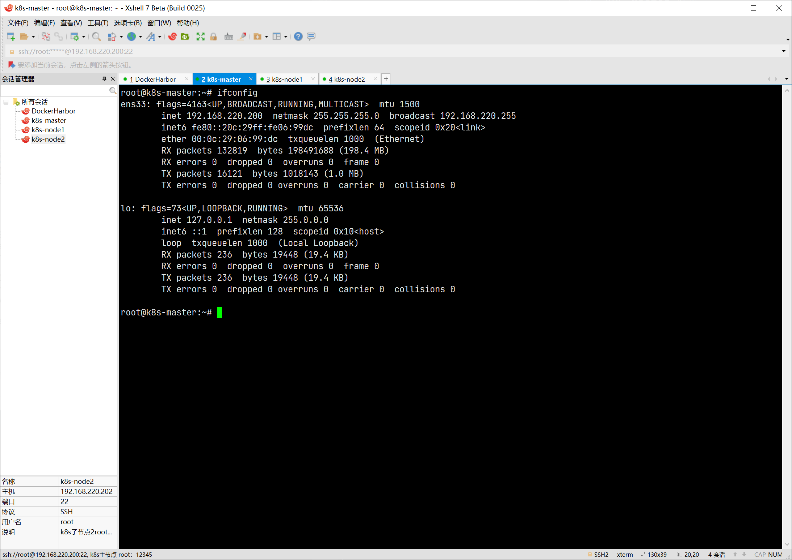
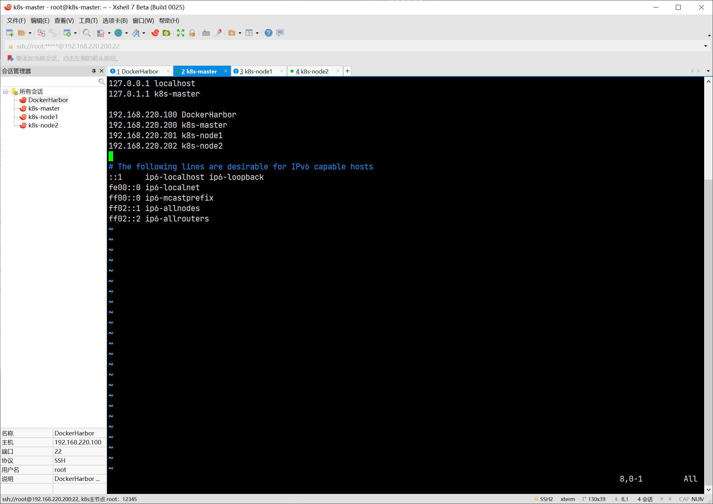
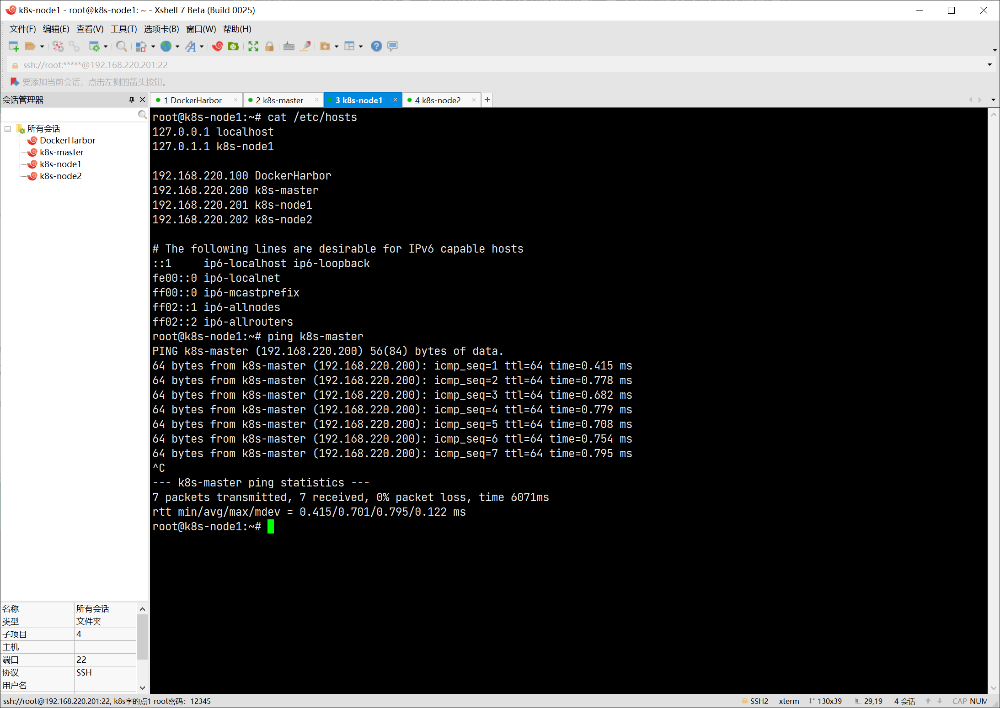
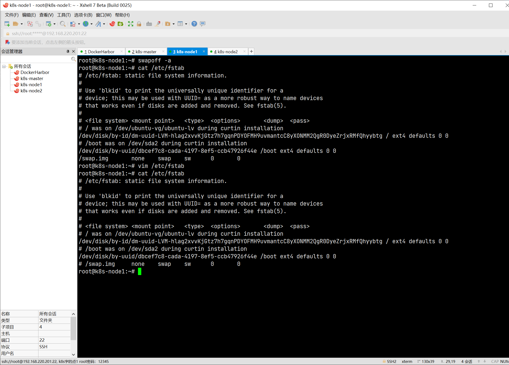

# [K8S 集群搭建](https://kubernetes.io/zh/docs/home/)

## 前期准备

### 准备 4 台虚拟机，分别用于

1. 私有镜像库 Harbor（其实这一步如果使用阿里云镜像加速，也可以不需要专门私有镜像仓库）
2. K8S Master 结点
3. K8S Node 结点 1
4. K8S Node 结点 2
   

### 将 4 台主机名和 ip 都写入到 3 个 K8S 虚拟机的 hosts 文件中

```shell
vim /etc/hosts
# 添加
192.168.220.100 DockerHarbor
192.168.220.200 k8s-master
192.168.220.201 k8s-node1
192.168.220.202 k8s-node2
```



> 修改完保存之后直接生效（都不需要重启网卡）。



## [开始安装，使用 kubeadm](https://kubernetes.io/zh/docs/setup/production-environment/tools/kubeadm/install-kubeadm/)

### 禁用交换分区

```shell
swapoff -a
# 注释掉最后一行
vim /etc/fstab
```



### 允许 iptables 检查桥接流量

```shell
cat <<EOF | sudo tee /etc/modules-load.d/k8s.conf
br_netfilter
EOF

cat <<EOF | sudo tee /etc/sysctl.d/k8s.conf
net.bridge.bridge-nf-call-ip6tables = 1
net.bridge.bridge-nf-call-iptables = 1
EOF
sudo sysctl --system
```

### [安装 Docker](https://docs.docker.com/engine/install/ubuntu/)


### 安装 kubeadm、kubelet 和 kubectl
```shell
# 更新 apt 包索引并安装使用 Kubernetes apt 仓库所需要的包：
sudo apt update
sudo apt install -y apt-transport-https ca-certificates curl
# 下载 Google Cloud 公开签名秘钥：
echo "deb [signed-by=/usr/share/keyrings/kubernetes-archive-keyring.gpg] https://apt.kubernetes.io/ kubernetes-xenial main" | sudo tee /etc/apt/sources.list.d/kubernetes.list
# 更新 apt 包索引，安装 kubelet、kubeadm 和 kubectl，并锁定其版本：
sudo apt update
# 失败
# W: Failed to fetch https://apt.kubernetes.io/dists/kubernetes-xenial/InRelease  Could not connect to packages.cloud.google.com:443 (172.217.27.142). - connect (111: Connection refused)
# W: Some index files failed to download. They have been ignored, or old ones used instead.

sudo apt install -y kubelet kubeadm kubectl
sudo apt-mark hold kubelet kubeadm kubectl
```