# Spring Native

## 环境

1. **系统：Windows10 21H1**
   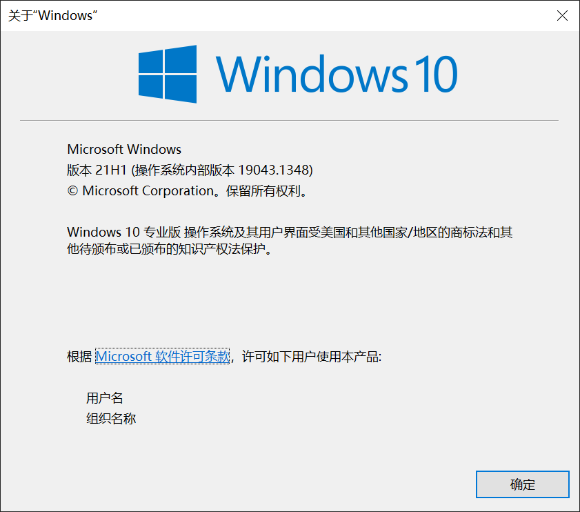

2. **GraalVM：22.0.0.2**
   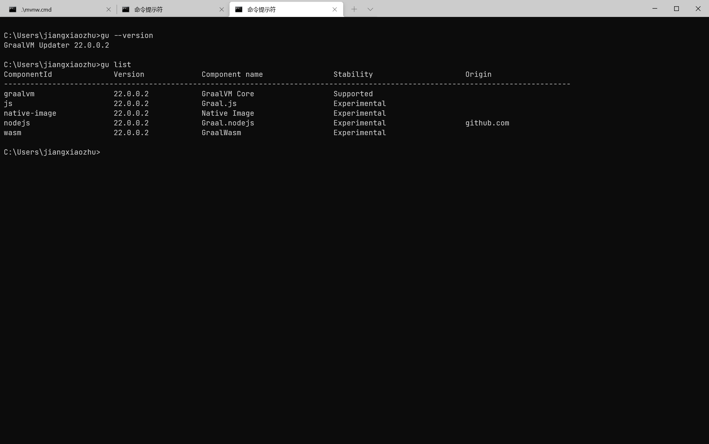

3. **Visual Studio2019：Version 16.11.10**
   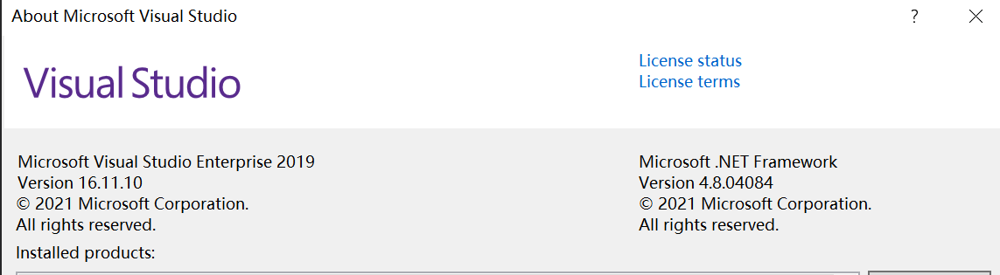

4. **java：openjdk version "17.0.2" 或者使用 GraalVM 自带的也行**
   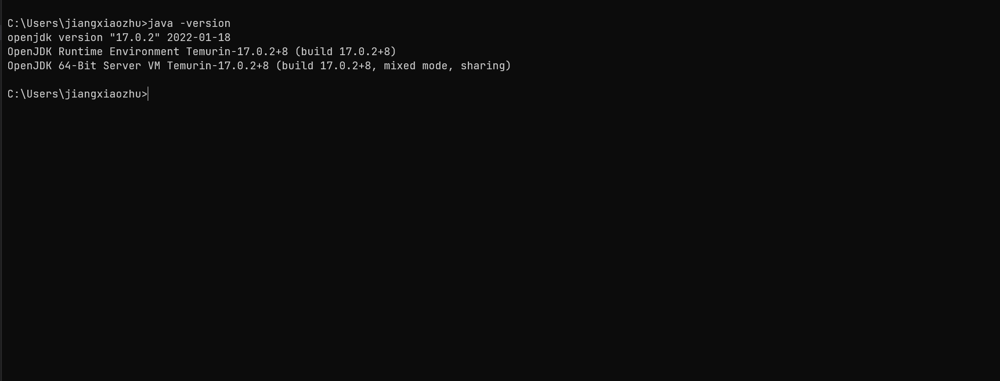

5. **idea：2021.2.3**
   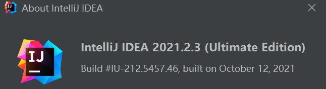

6. **Maven：3.6.3**
   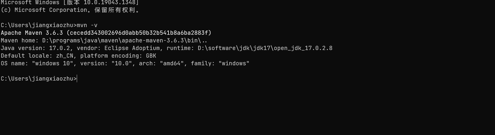

## [参考：https://docs.spring.io/spring-native/docs/current/reference/htmlsingle/](https://docs.spring.io/spring-native/docs/current/reference/htmlsingle/)

## 创建项目

直接使用 `idea` 自带的 `Spring Initializr`

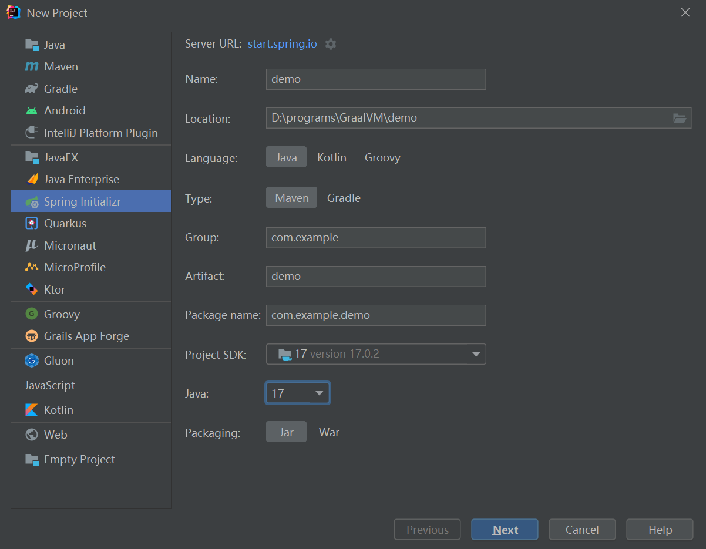

选择 `Spring Native`、`Spring Web`

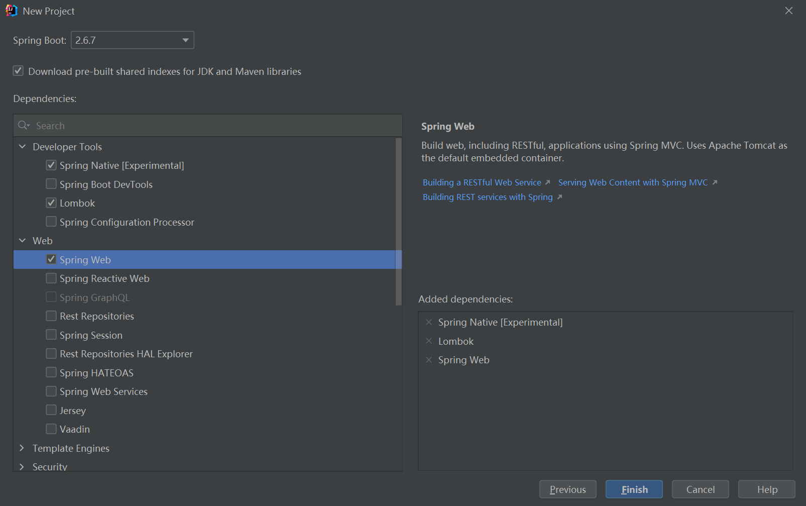

初始项目 `pom` 文件

```xml
<?xml version="1.0" encoding="UTF-8"?>
<project xmlns="http://maven.apache.org/POM/4.0.0" xmlns:xsi="http://www.w3.org/2001/XMLSchema-instance"
         xsi:schemaLocation="http://maven.apache.org/POM/4.0.0 https://maven.apache.org/xsd/maven-4.0.0.xsd">
    <modelVersion>4.0.0</modelVersion>
    <parent>
        <groupId>org.springframework.boot</groupId>
        <artifactId>spring-boot-starter-parent</artifactId>
        <version>2.6.7</version>
        <relativePath/> <!-- lookup parent from repository -->
    </parent>
    <groupId>com.example</groupId>
    <artifactId>demo</artifactId>
    <version>0.0.1-SNAPSHOT</version>
    <name>demo</name>
    <description>demo</description>
    <properties>
        <java.version>17</java.version>
        <repackage.classifier/>
        <spring-native.version>0.11.4</spring-native.version>
    </properties>
    <dependencies>
        <dependency>
            <groupId>org.springframework.boot</groupId>
            <artifactId>spring-boot-starter-web</artifactId>
        </dependency>
        <dependency>
            <groupId>org.springframework.experimental</groupId>
            <artifactId>spring-native</artifactId>
            <version>${spring-native.version}</version>
        </dependency>

        <dependency>
            <groupId>org.projectlombok</groupId>
            <artifactId>lombok</artifactId>
            <optional>true</optional>
        </dependency>
        <dependency>
            <groupId>org.springframework.boot</groupId>
            <artifactId>spring-boot-starter-test</artifactId>
            <scope>test</scope>
        </dependency>
    </dependencies>

    <build>
        <plugins>
            <plugin>
                <groupId>org.springframework.boot</groupId>
                <artifactId>spring-boot-maven-plugin</artifactId>
                <configuration>
                    <excludes>
                        <exclude>
                            <groupId>org.projectlombok</groupId>
                            <artifactId>lombok</artifactId>
                        </exclude>
                    </excludes>
                    <classifier>${repackage.classifier}</classifier>
                    <image>
                        <builder>paketobuildpacks/builder:tiny</builder>
                        <env>
                            <BP_NATIVE_IMAGE>true</BP_NATIVE_IMAGE>
                        </env>
                    </image>
                </configuration>
            </plugin>
            <plugin>
                <groupId>org.springframework.experimental</groupId>
                <artifactId>spring-aot-maven-plugin</artifactId>
                <version>${spring-native.version}</version>
                <executions>
                    <execution>
                        <id>test-generate</id>
                        <goals>
                            <goal>test-generate</goal>
                        </goals>
                    </execution>
                    <execution>
                        <id>generate</id>
                        <goals>
                            <goal>generate</goal>
                        </goals>
                    </execution>
                </executions>
            </plugin>
        </plugins>
    </build>
    <repositories>
        <repository>
            <id>spring-releases</id>
            <name>Spring Releases</name>
            <url>https://repo.spring.io/release</url>
            <snapshots>
                <enabled>false</enabled>
            </snapshots>
        </repository>
    </repositories>
    <pluginRepositories>
        <pluginRepository>
            <id>spring-releases</id>
            <name>Spring Releases</name>
            <url>https://repo.spring.io/release</url>
            <snapshots>
                <enabled>false</enabled>
            </snapshots>
        </pluginRepository>
    </pluginRepositories>

    <profiles>
        <profile>
            <id>native</id>
            <properties>
                <repackage.classifier>exec</repackage.classifier>
                <native-buildtools.version>0.9.11</native-buildtools.version>
            </properties>
            <dependencies>
                <dependency>
                    <groupId>org.junit.platform</groupId>
                    <artifactId>junit-platform-launcher</artifactId>
                    <scope>test</scope>
                </dependency>
            </dependencies>
            <build>
                <plugins>
                    <plugin>
                        <groupId>org.graalvm.buildtools</groupId>
                        <artifactId>native-maven-plugin</artifactId>
                        <version>${native-buildtools.version}</version>
                        <extensions>true</extensions>
                        <executions>
                            <execution>
                                <id>test-native</id>
                                <phase>test</phase>
                                <goals>
                                    <goal>test</goal>
                                </goals>
                            </execution>
                            <execution>
                                <id>build-native</id>
                                <phase>package</phase>
                                <goals>
                                    <goal>build</goal>
                                </goals>
                            </execution>
                        </executions>
                    </plugin>
                </plugins>
            </build>
        </profile>
    </profiles>
</project>
```

初始项目结构

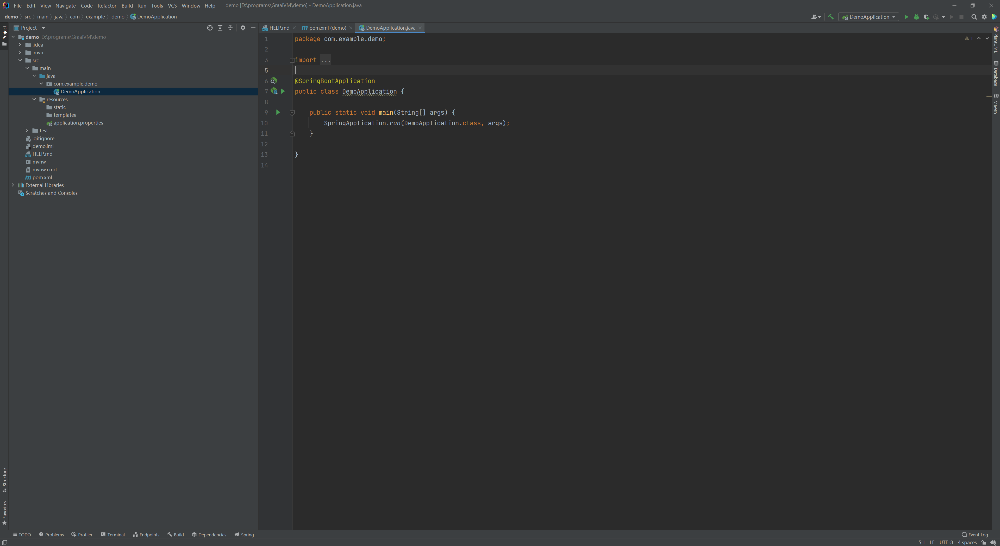

## 简单 `Hello World`

```java
package com.example.demo;

import lombok.extern.slf4j.Slf4j;
import org.springframework.boot.SpringApplication;
import org.springframework.boot.autoconfigure.SpringBootApplication;
import org.springframework.web.bind.annotation.GetMapping;
import org.springframework.web.bind.annotation.RequestParam;
import org.springframework.web.bind.annotation.RestController;

@Slf4j
@RestController
@SpringBootApplication
public class DemoApplication {

    public static void main(String[] args) {
        SpringApplication.run(DemoApplication.class, args);
    }

    @GetMapping("/hello")
    public String helloWorld(@RequestParam("name") String name) {
        log.info("========>收到请求：name={}", name);
        return "Hello World " + name;
    }
}
```

## 编译项目

1. 进入项目根目录

   ```bat
   cd /d D:\programs\GraalVM\demo
   ```

2. 设置 `Visual Studio` 编译环境

   ```bat
   call "C:\Program Files (x86)\Microsoft Visual Studio\2019\Enterprise\VC\Auxiliary\Build\vcvars64.bat"
   ```

3. 开始编译（CPU 使用率疯狂飙升，风扇疯狂旋转…………）

   ```bat
    mvn -Pnative -DskipTests package
   ```

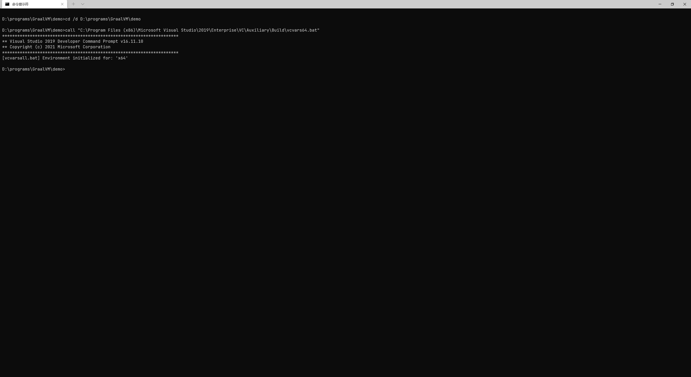
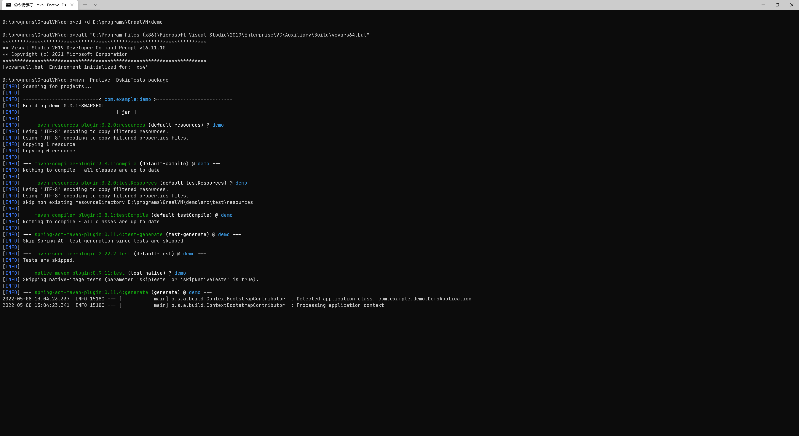
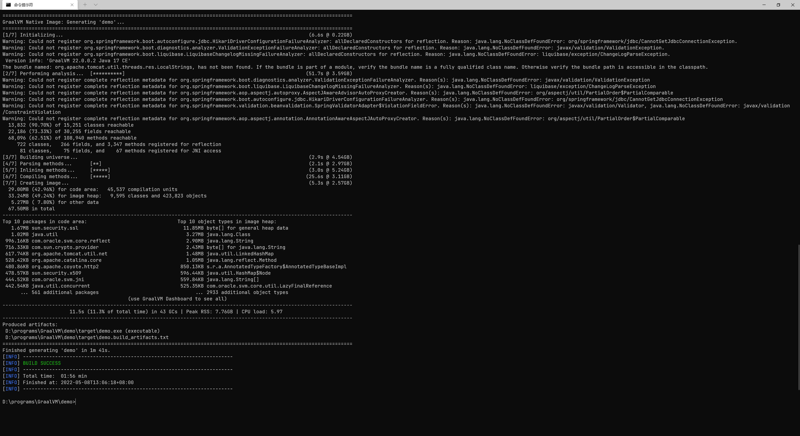

## 启动项目

进入`D:\programs\GraalVM\demo\target` （或者将`D:\programs\GraalVM\demo\target\demo.exe`复制到任意其它目录下双击`demo.exe`）

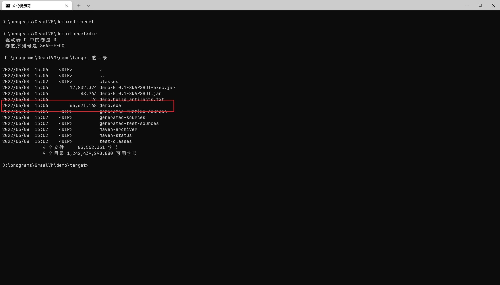
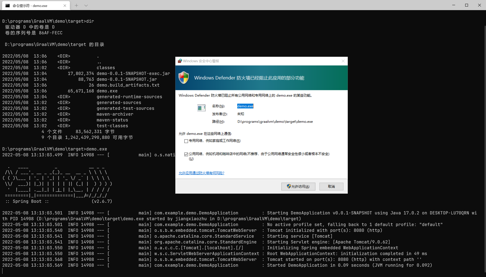

打开浏览器访问`http://localhost:8080/hello?name=张三`

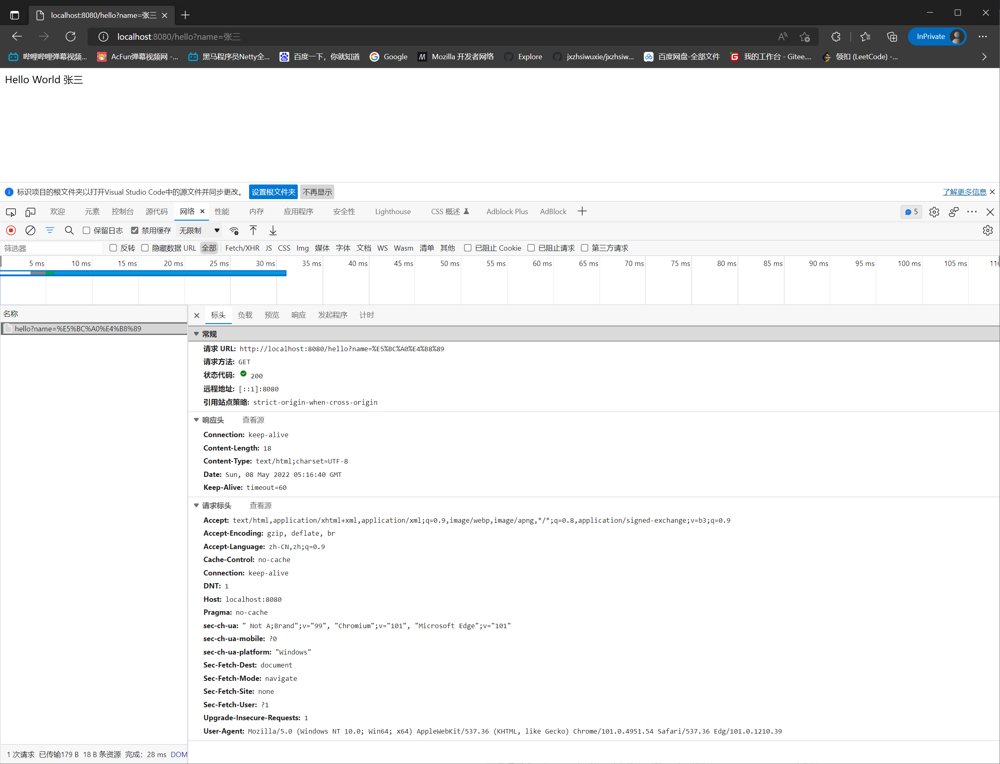
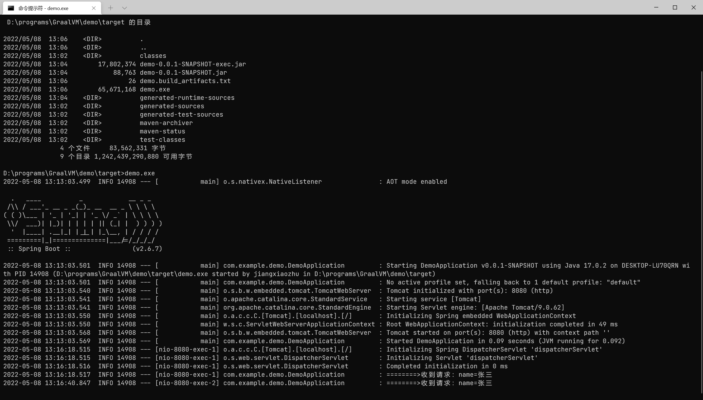

## 另外

测试将 `demo.exe` 单文件复制到未安装 `java` 环境也未安装 `GraalVM` 环境的电脑上也完全可以正常运行。
但是另一方面，只是如此简单的项目，编译后可执行文件却有`62MB`。
