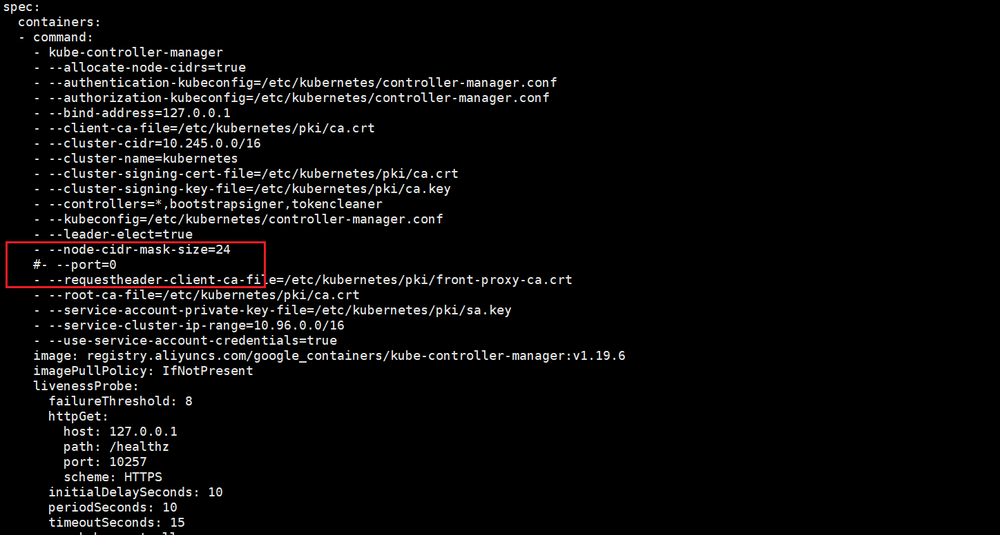
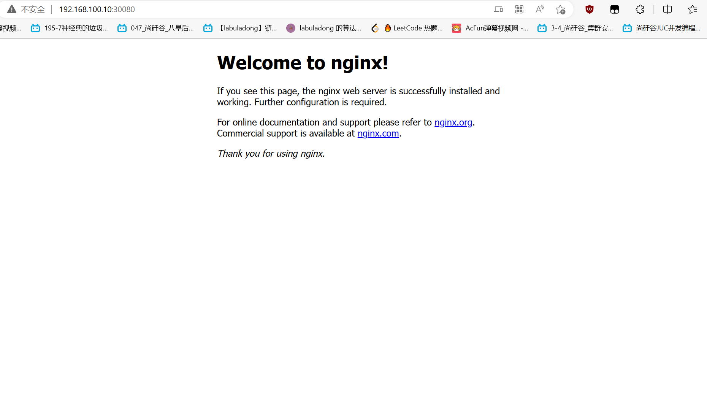

# K8S 集群部署

## 网络选择

使用一主两从的集群部署
>使用网段 `192.168.100.0/24`

1. `k8s-master01` ip 地址 `192.168.100.10`
2. `k8s-node01` ip 地址 `192.168.100.20`
3. `k8s-node02` ip 地址 `192.168.100.21`

>VMWare 设置网络为 `NAT` 模式，同时关闭 `DHCP` 获取 `ip` 的方式
> 将网关设置为 192.168.100.2 为什么不是 `.1`

[参考1](https://cloud.tencent.com/developer/inventory/499/article/1691013)
[参考2](https://zhuanlan.zhihu.com/p/130984945)


```sh
vi /etc/sysconfig/network-scripts/ifcfg-ens33


# master 配置
TYPE=Ethernet
PROXY_METHOD=none
BROWSER_ONLY=no
BOOTPROTO=static
DEFROUTE=yes
IPV4_FAILURE_FATAL=no
IPV6INIT=yes
IPV6_AUTOCONF=yes
IPV6_DEFROUTE=yes
IPV6_FAILURE_FATAL=no
IPV6_ADDR_GEN_MODE=stable-privacy
NAME=ens33
UUID=382c66d5-070d-4251-8b7b-fa4186812a9a
DEVICE=ens33
ONBOOT=yes
IPADDR=192.168.100.10
NETMASK=255.255.255.0
GATEWAY=192.168.100.2
DNS1=192.168.100.2
DNS2=114.114.114.114

# node01 配置
TYPE=Ethernet
PROXY_METHOD=none
BROWSER_ONLY=no
BOOTPROTO=static
DEFROUTE=yes
IPV4_FAILURE_FATAL=no
IPV6INIT=yes
IPV6_AUTOCONF=yes
IPV6_DEFROUTE=yes
IPV6_FAILURE_FATAL=no
IPV6_ADDR_GEN_MODE=stable-privacy
NAME=ens33
UUID=382c66d5-070d-4251-8b7b-fa4186812a9a
DEVICE=ens33
ONBOOT=yes
IPADDR=192.168.100.20
NETMASK=255.255.255.0
GATEWAY=192.168.100.2
DNS1=192.168.100.2
DNS2=114.114.114.114

# node02 配置
TYPE=Ethernet
PROXY_METHOD=none
BROWSER_ONLY=no
BOOTPROTO=static
DEFROUTE=yes
IPV4_FAILURE_FATAL=no
IPV6INIT=yes
IPV6_AUTOCONF=yes
IPV6_DEFROUTE=yes
IPV6_FAILURE_FATAL=no
IPV6_ADDR_GEN_MODE=stable-privacy
NAME=ens33
UUID=382c66d5-070d-4251-8b7b-fa4186812a9a
DEVICE=ens33
ONBOOT=yes
IPADDR=192.168.100.21
NETMASK=255.255.255.0
GATEWAY=192.168.100.2
DNS1=192.168.100.2
DNS2=114.114.114.114

# 重启
reboot

# ssh 连接 master 节点
ssh root@192.168.100.10

```

## 系统配置

### 系统配置修改（三台服务器都要执行）

```sh
# 查看内核linux版本
cat /proc/version
# [root@localhost ~]# cat /proc/version
# Linux version 3.10.0-1160.el7.x86_64 (mockbuild@kbuilder.bsys.centos.org) (gcc version 4.8.5 20150623 (Red Hat 4.8.5-44) (GCC) ) #1 SMP Mon Oct 19 16:18:59 UTC 2020

# 关闭防火墙
systemctl stop firewalld && systemctl disable firewalld && iptables -F
# 关闭selinux
# sed -i 's/^SELINUX=enforcing$/SELINUX=permissive/' /etc/selinux/config && setenforce 0
sed -i 's/enforcing/disabled/' /etc/selinux/config && setenforce 0

# 关闭swap 且 写入到 /etc/fstab 文件中，保证重启机器也生效
swapoff -a && sed -ri 's/.*swap.*/#&/' /etc/fstab

# 配置iptables的ACCEPT规则
# iptables -F && iptables -X && iptables -F -t nat && iptables -X -t nat && iptables -P FORWARD ACCEPT

# 设置系统参数
cat > /etc/sysctl.d/k8s.conf << EOF
net.bridge.bridge-nf-call-ip6tables = 1
net.bridge.bridge-nf-call-iptables = 1
net.ipv4.ip_forward = 1
EOF

sysctl --system
```

### 系统时区

```sh
# 查看当前系统时区
timedatectl status
#      Local time: 一 2023-03-20 23:40:52 CST
#   Universal time: 一 2023-03-20 15:40:52 UTC
#         RTC time: 一 2023-03-20 15:40:52
#        Time zone: Asia/Shanghai (CST, +0800)
#      NTP enabled: yes
# NTP synchronized: yes
#  RTC in local TZ: no
#       DST active: n/a

# 如果不一样则设置成一样的
timedatectl set-timezone Asia/Shanghai

# 设置时钟同步
systemctl start chronyd
systemctl enable chronyd

```

### 固定主机名

```sh
# 查看当前主机名
uname -n
hostname
# localhost.localdomain

# 设置当前主机名同时修改 hosts 文件
# master01 节点执行
hostnamectl set-hostname k8s-master01
# ndoe01 节点执行
hostnamectl set-hostname k8s-node01
# ndoe02 节点执行
hostnamectl set-hostname k8s-node02

# 三个节点都执行
cat /etc/hosts

# 向 hosts 追加 ip 主机名 映射
cat >> /etc/hosts <<-'EOF'

192.168.100.10 k8s-master01
192.168.100.20 k8s-node01
192.168.100.21 k8s-node02
EOF

# 再次查看 hosts 内容
cat /etc/hosts

# 设置完成后，重启网路服务
systemctl restart network

# 或者在 master01 上执行之后直接使用文件分发
scp /etc/hosts k8s-node01:/etc/
scp /etc/hosts k8s-node02:/etc/

# 查看是否设置成功，在 master 和 node 之间通过主机名 ping
ping k8s-master01
ping k8s-node01
ping k8s-node02
```

## 安装 Docker（三台服务器都同样安装）

```sh
yum -y install wget
# 配置阿里云 yum 源
wget https://mirrors.aliyun.com/docker-ce/linux/centos/docker-ce.repo -O /etc/yum.repos.d/docker-ce.repo

# 查看当前支持的docker版本
yum list docker-ce --showduplicates

# 安装特定版本的 docker 这里使用 19.03.9-3.el7
yum -y install docker-ce-19.03.9-3.el7 docker-ce-cli-19.03.9-3.el7

# 编辑docker配置文件
# docker默认情况下使用cgroup driver作为cgroupfs，而k8s推荐使用systemd来代替cgroupfs
mkdir /etc/docker/
cat > /etc/docker/daemon.json << EOF
{
    "registry-mirrors": ["https://gqs7xcfd.mirror.aliyuncs.com","https://hub-mirror.c.163.com"],
    "exec-opts": ["native.cgroupdriver=systemd"],
    "log-driver": "json-file",
    "log-opts": {
        "max-size": "100m"
    },
    "storage-driver": "overlay2"
}
EOF

# 启动docker
systemctl daemon-reload && systemctl enable docker && systemctl start docker

# 查看docker版本
docker version
```

## 所有节点安装 kubeadm、kubelet 和 kubectl

```sh
# 配置yum源
cat > /etc/yum.repos.d/kubernetes.repo << EOF
[kubernetes]
name=Kubernetes
baseurl=https://mirrors.aliyun.com/kubernetes/yum/repos/kubernetes-el7-x86_64/
enabled=1
gpgcheck=1
repo_gpgcheck=1
gpgkey=https://mirrors.aliyun.com/kubernetes/yum/doc/yum-key.gpg
       https://mirrors.aliyun.com/kubernetes/yum/doc/rpm-package-key.gpg
EOF

# 复制到k8s-node01、k8s-node02
scp /etc/yum.repos.d/kubernetes.repo k8s-node01:/etc/yum.repos.d/
scp /etc/yum.repos.d/kubernetes.repo k8s-node02:/etc/yum.repos.d/

# 查看
cat /etc/yum.repos.d/kubernetes.repo

# 查询 kubeadm、kubelet、kubectl 可用的版本
yum list kubeadm --showduplicates
yum list kubelet --showduplicates
yum list kubectl --showduplicates

# 安装指定版本的 kubeadm、kubelet、kubectl（这里使用 1.19.6-0）
yum install -y kubeadm-1.19.6-0 kubelet-1.19.6-0 kubectl-1.19.6-0


# 设置kubelet开机自启
# 安装好kubelet后先不用启动，当集群初始化的时候会自动启动kubelet，选择启动kubelet会报错
systemctl enable kubelet

# 查看版本
kubectl version
kubelet --version
kubeadm version
```

### Master 节点初始化

```sh
# 指定k8s的版本、pod网络地址段、service资源网络地址段、apiserver地址
# apiserver-advertise-address 指定为执行的 master ip
kubeadm init \
--kubernetes-version=1.19.6 \
--apiserver-advertise-address=0.0.0.0 \
--service-cidr=10.96.0.0/16 \
--pod-network-cidr=10.245.0.0/16 \
--image-repository registry.aliyuncs.com/google_containers \
--apiserver-advertise-address=192.168.100.10


# 最终执行成功时日志

# Your Kubernetes control-plane has initialized successfully!
#
# To start using your cluster, you need to run the following as a regular user:
#
#   mkdir -p $HOME/.kube
#   sudo cp -i /etc/kubernetes/admin.conf $HOME/.kube/config
#   sudo chown $(id -u):$(id -g) $HOME/.kube/config
#
# You should now deploy a pod network to the cluster.
# Run "kubectl apply -f [podnetwork].yaml" with one of the options listed at:
#   https://kubernetes.io/docs/concepts/cluster-administration/addons/
#
# Then you can join any number of worker nodes by running the following on each as root:
#
# kubeadm join 192.168.100.10:6443 --token bhid43.o7mj1qdfjjzdo3dv \
#     --discovery-token-ca-cert-hash sha256:839de59433230cc3a84a7fa0b87d4f0c6fdfc5a1d4e1668cb6caa348b585bd18 
#

# 这个信息非常重要
# kubeadm join 192.168.100.10:6443 --token bhid43.o7mj1qdfjjzdo3dv \
#     --discovery-token-ca-cert-hash sha256:839de59433230cc3a84a7fa0b87d4f0c6fdfc5a1d4e1668cb6caa348b585bd18 

# 创建必要文件（在上面打印的信息中也能看到）
# 这些文件是使用 kubectl 命令的前提，kubectl 命令使用是需要去找 config 配置文件
mkdir -p $HOME/.kube
sudo cp -i /etc/kubernetes/admin.conf $HOME/.kube/config
sudo chown $(id -u):$(id -g) $HOME/.kube/config

# 查看master是否加入集群
kubectl get node
```

### k8s-node01、k8s-node02 加入集群 (分别在两台 node 机子上执行)

```sh
# 使用初始化 master 节点时给出的信息
kubeadm join 192.168.100.10:6443 --token bhid43.o7mj1qdfjjzdo3dv \
    --discovery-token-ca-cert-hash sha256:839de59433230cc3a84a7fa0b87d4f0c6fdfc5a1d4e1668cb6caa348b585bd18
# 执行成功后打印出
# This node has joined the cluster:
# * Certificate signing request was sent to apiserver and a response was received.
# * The Kubelet was informed of the new secure connection details.
#
# Run 'kubectl get nodes' on the control-plane to see this node join the cluster.

```

### 集群配置网络插件 flannel

```sh
yum install -y lrzsz

# 配置文件可从这里获取 https://raw.githubusercontent.com/coreos/flannel/master/Documentation/kube-flannel.yml
# 注意 "Network": "10.245.0.0/16", 地址需与初始化pod-network-cid地址保持一致
# 同时记得配置文件中的镜像地址使用 docker.io/flannel 而不要使用 docker.io/rancher 否则下载不了
# coredns会在网络组件安装成功后恢复正常
kubectl apply -f ./kube-flannel.yml

# 三个节点都重启kubelet服务
systemctl restart kubelet
```

> 到此不出意外的话 `K8S` 集群已经成功启动了。

### 遗留问题解决

```sh
# 查看组件健康状态
kubectl get cs
# NAME                 STATUS      MESSAGE                                                                                       ERROR
# scheduler            Unhealthy   Get "http://127.0.0.1:10251/healthz": dial tcp 127.0.0.1:10251: connect: connection refused   
# controller-manager   Unhealthy   Get "http://127.0.0.1:10252/healthz": dial tcp 127.0.0.1:10252: connect: connection refused   
# etcd-0               Healthy     {"health":"true"}  

# 出现这种情况，是 /etc/kubernetes/manifests/ 下的
# kube-controller-manager.yaml 和 kube-scheduler.yaml 设置的默认端口是0导致的，
# 解决方式是注释掉对应的port即可
```




```sh
# 注释掉这两行之后，重启kubelet服务
systemctl restart kubelet

# 再次查看组件健康状态，已经都正常了
kubectl get cs
# Warning: v1 ComponentStatus is deprecated in v1.19+
# NAME                 STATUS    MESSAGE             ERROR
# scheduler            Healthy   ok                  
# controller-manager   Healthy   ok                  
# etcd-0               Healthy   {"health":"true"}  

# 查看节点状态
kubectl get nodes
# NAME           STATUS   ROLES    AGE   VERSION
# k8s-master01   Ready    master   21h   v1.19.6
# k8s-node01     Ready    <none>   21h   v1.19.6
# k8s-node02     Ready    <none>   21h   v1.19.6
```

## 向 K8S 集群中部署一些服务

### 创建命名空间 ns-test

```yaml
apiVersion: v1
kind: Namespace
metadata:
  name: ns-test
  labels:
    name: label-test
```

```sh
cat > ~/namespace-test.yaml << EOF
apiVersion: v1
kind: Namespace
metadata:
  name: ns-test
  labels:
    name: label-test
EOF

# 创建命名空间
kubectl apply -f ~/namespace-test.yaml
# 查询所有命名空间
kubectl get namespace
```

### 创建 deployment

```yaml
apiVersion: apps/v1
kind: Deployment
metadata:
  namespace: ns-test
  name: nginx-test
spec:
  selector:
    matchLabels:
      app: nginx
  replicas: 2
  template:
    metadata:
      labels:
        app: nginx
    spec:
      containers:
      - name: nginx
        image: nginx:alpine
        ports:
        - containerPort: 80
```

```sh
cat > ~/nginx-test.yaml << EOF
apiVersion: apps/v1
kind: Deployment
metadata:
  namespace: ns-test
  name: nginx-test
spec:
  selector:
    matchLabels:
      app: nginx
  replicas: 1
  template:
    metadata:
      labels:
        app: nginx
    spec:
      containers:
      - name: nginx
        image: nginx:alpine
        ports:
        - containerPort: 80
EOF

# 创建 deployment
kubectl apply -f ~/nginx-test.yaml
# 查询所有 deployment 或 pod
kubectl get deployment -n ns-test
kubectl get pod -n ns-test -o wide
```

此时通过 `kubectl get pod -n ns-test -o wide` 获得的 `pod` 的 `ip` 已经能够访问了。三个节点上都是可以访问的。  
但是在集群外部还是无法访问的。


### 创建 service

```yaml
apiVersion: v1
kind: Service
metadata:
  name: nginx-service
  namespace: ns-test
spec:
  type: NodePort
  selector:
    app: nginx
  ports:
  - protocol: TCP
    port: 80
    targetPort: 80
    nodePort: 1080
```

```sh
cat > ~/service-test.yaml << EOF
apiVersion: v1
kind: Service
metadata:
  name: nginx-service
  namespace: ns-test
spec:
  type: NodePort
  selector:
    app: nginx
  ports:
  - protocol: TCP
    port: 80
    targetPort: 80
    nodePort: 30080
EOF

# 创建 service
kubectl apply -f ~/service-test.yaml
# 查询所有 service
kubectl get svc -n ns-test
```

此时在 `k8s` 集群外部，例如在 `VMWare` 的宿主机上，利用 `k8s-master01` 的 `ip: 192.168.100.10` 加上 `nodePort: 30080`  
即可访问集群内的 `Nginx` 服务（实际上使用集群中任意一个节点的主机 `ip` 加上 `30080` 都是同样可以访问的）。


