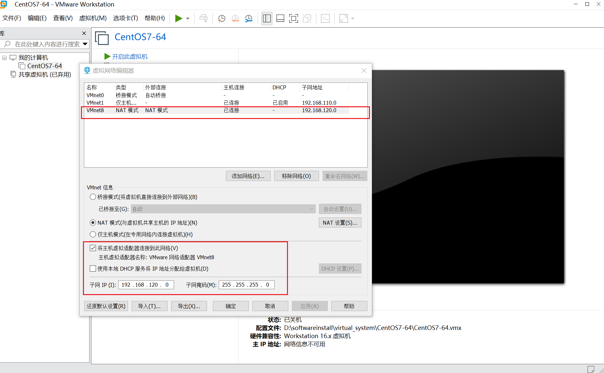
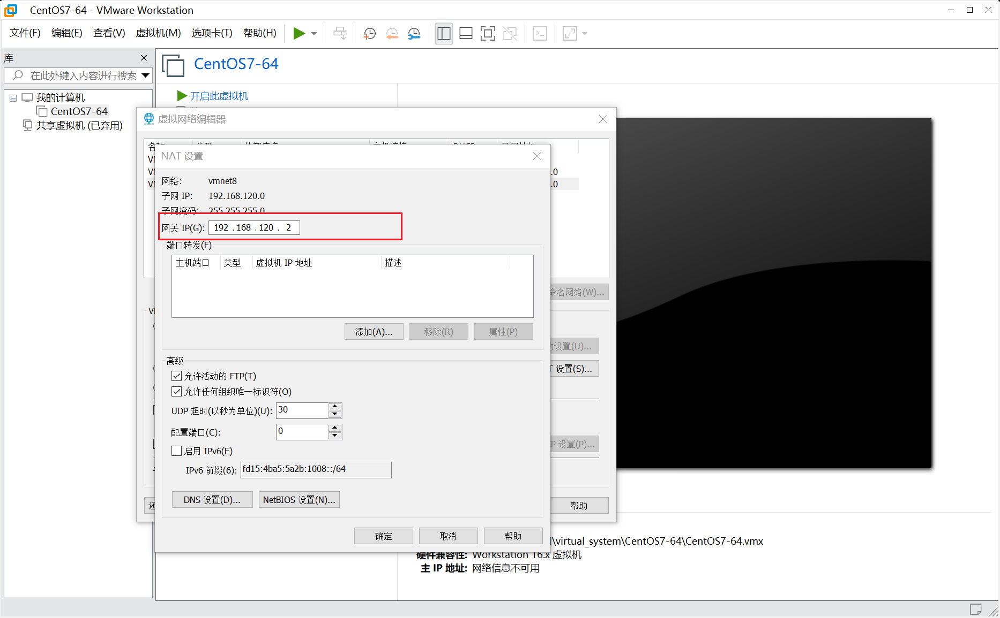
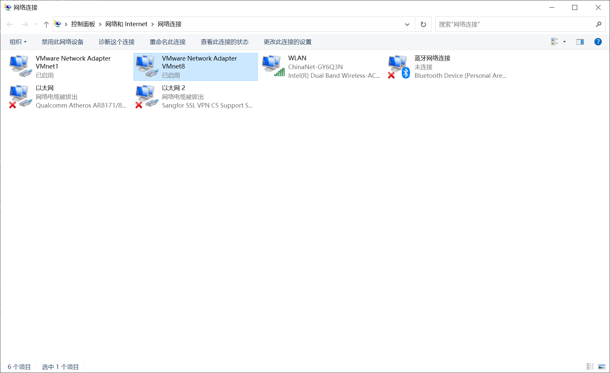
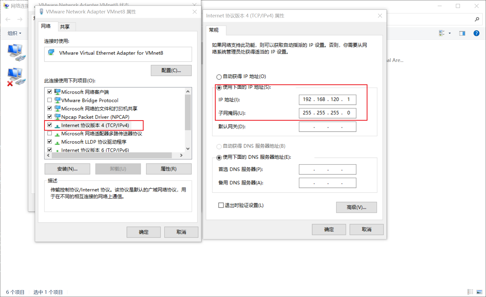

# K8S 集群搭建

## 系统设置

### 机器 IP 设置

使用一主两从的集群部署
>使用网段 `192.168.120.0/24`，虚拟机网卡使用 `NAT` 模式，同时关闭 `DHCP` 使用静态 `IP`。

1. `k8s-master01` ip 地址 `192.168.120.110`
2. `k8s-node01` ip 地址 `192.168.120.120`
3. `k8s-node02` ip 地址 `192.168.120.121`

>VMWare 设置网络为 `NAT` 模式，同时关闭 `DHCP` 获取 `ip` 的方式
> 将网关设置为 192.168.120.2




>同时宿主机的网络设配置 `VMnet8` 需要设置固定 `IP`，设置->以太网->更改适配器选项



```sh
vi /etc/sysconfig/network-scripts/ifcfg-ens33
# 修改 BOOTPROTO 为 static
# 修改 ONBOOT 为 yes
# 添加 IPADDR、NETMASK、GATEWAY、DNS1、DNS2（可选）

# 修改完之后重启网卡
service network restart

# k8s-master01
TYPE=Ethernet
PROXY_METHOD=none
BROWSER_ONLY=no
BOOTPROTO=static
DEFROUTE=yes
IPV4_FAILURE_FATAL=no
IPV6INIT=yes
IPV6_AUTOCONF=yes
IPV6_DEFROUTE=yes
IPV6_FAILURE_FATAL=no
IPV6_ADDR_GEN_MODE=stable-privacy
NAME=ens33
UUID=3468e44b-32d5-4eb4-b6c9-61c417adb084
DEVICE=ens33
ONBOOT=yes
IPADDR=192.168.120.110
NETMASK=255.255.255.0
GATEWAY=192.168.120.2
DNS1=192.168.120.2
DNS2=114.114.114.114

# k8s-node01
TYPE=Ethernet
PROXY_METHOD=none
BROWSER_ONLY=no
BOOTPROTO=static
DEFROUTE=yes
IPV4_FAILURE_FATAL=no
IPV6INIT=yes
IPV6_AUTOCONF=yes
IPV6_DEFROUTE=yes
IPV6_FAILURE_FATAL=no
IPV6_ADDR_GEN_MODE=stable-privacy
NAME=ens33
UUID=3468e44c-32d5-4eb4-b6c9-61c417adb084
DEVICE=ens33
ONBOOT=yes
IPADDR=192.168.120.120
NETMASK=255.255.255.0
GATEWAY=192.168.120.2
DNS1=192.168.120.2
DNS2=114.114.114.114

# k8s-node02
TYPE=Ethernet
PROXY_METHOD=none
BROWSER_ONLY=no
BOOTPROTO=static
DEFROUTE=yes
IPV4_FAILURE_FATAL=no
IPV6INIT=yes
IPV6_AUTOCONF=yes
IPV6_DEFROUTE=yes
IPV6_FAILURE_FATAL=no
IPV6_ADDR_GEN_MODE=stable-privacy
NAME=ens33
UUID=3468e44d-32d5-4eb4-b6c9-61c417adb084
DEVICE=ens33
ONBOOT=yes
IPADDR=192.168.120.121
NETMASK=255.255.255.0
GATEWAY=192.168.120.2
DNS1=192.168.120.2
DNS2=114.114.114.114
```

>此时就可以使用 `XShell` 来连接了。

### 固定主机名

```sh
# 查看当前主机名
uname -n
# localhost.localdomain

# 设置当前主机名同时修改 hosts 文件
# master01 节点执行
hostnamectl set-hostname k8s-master01
# ndoe01 节点执行
hostnamectl set-hostname k8s-node01
# ndoe02 节点执行
hostnamectl set-hostname k8s-node02

# 三个节点都执行（或者在 master01 上执行之后将 hosts 文件拷贝到另外两台机器上）
cat /etc/hosts

# 向 hosts 追加 ip 主机名 映射
cat >> /etc/hosts <<EOF

192.168.120.110 k8s-master01
192.168.120.120 k8s-node01
192.168.120.121 k8s-node02
EOF

# 再次查看 hosts 内容
cat /etc/hosts

# 将 hosts 文件拷贝到 node01 和 node02 机器对应的目录中
scp /etc/hosts root@k8s-node01:/etc/hosts
scp /etc/hosts root@k8s-node02:/etc/hosts

# 查看是否设置成功，在 master 和 node 之间通过主机名 ping
ping k8s-master01
ping k8s-node01
ping k8s-node02
```

### 升级内核版本（三台机器都需要升级），这里使用清华源的配置

```sh
# 查看当前内核版本
uname -rs
# Linux 3.10.0-1160.el7.x86_64

# 查看启动时使用的默认内核版本
grub2-editenv list
# saved_entry=CentOS Linux (3.10.0-1160.el7.x86_64) 7 (Core)
```

[Linux运维之CentOS 7 升级内核版本](https://developer.aliyun.com/article/856525)
[阿里 Elrepo镜像](https://developer.aliyun.com/mirror/elrepo/?spm=a2c6h.25603864.0.0.5fa52ee0mOduJu)
[清华 ELRepo 软件仓库镜像使用帮助](https://mirrors.tuna.tsinghua.edu.cn/help/elrepo/)
[Linux 内核版本列表](https://www.kernel.org/)

```sh
# 在 CentOS 7 上启用 ELRepo 仓库
# 载入公钥
rpm --import https://www.elrepo.org/RPM-GPG-KEY-elrepo.org
# 安装 ELRepo 最新版本
yum install -y https://www.elrepo.org/elrepo-release-7.el7.elrepo.noarch.rpm

# 备份 /etc/yum.repos.d/elrepo.repo
# 然后编辑 /etc/yum.repos.d/elrepo.repo 文件，在 mirrorlist= 开头的行前面加 # 注释掉；
# 并将 http://elrepo.org/linux 替换为 http://mirrors.tuna.tsinghua.edu.cn/elrepo
sed -e 's|^mirrorlist=|#mirrorlist=|g' \
         -e 's|^baseurl=http://elrepo.org/linux|baseurl=http://mirrors.tuna.tsinghua.edu.cn/elrepo|g' \
         -i.bak \
         /etc/yum.repos.d/elrepo.repo

# 更新软件包缓存
sudo yum makecache

# 列出可使用的内核版本：kernel-lt 表示长期维护版，kernel-ml 表示主线稳定版
yum list available --disablerepo=* --enablerepo=elrepo-kernel

# 安装指定的 kernel 版本（例如 5.4.238-1.el7.elrepo）
yum --enablerepo=elrepo-kernel install -y kernel-lt-5.4.238-1.el7.elrepo
# 或者直接选择安装最新的 lt 版本
yum --enablerepo=elrepo-kernel install -y kernel-lt

# 设置开机从新内核启动
grub2-set-default "CentOS Linux (5.4.238-1.el7.elrepo.x86_64) 7 (Core)"
# 重启
reboot
# 查看新版本内核
uname -sr
# 查看内核启动项
grub2-editenv list

```

### 设置软件仓库源为国内镜像源（三台机器都需要执行，这里选择清华源）

[阿里 CentOS 镜像](https://developer.aliyun.com/mirror/centos)

[清华 CentOS 软件仓库镜像使用帮助](https://mirrors.tuna.tsinghua.edu.cn/help/centos/)

```sh
# 替换源（同时会将原始配置文件复制一份 .bak 备份）
sed -e 's|^mirrorlist=|#mirrorlist=|g' \
         -e 's|^#baseurl=http://mirror.centos.org/centos|baseurl=http://mirrors.tuna.tsinghua.edu.cn/centos|g' \
         -i.bak \
         /etc/yum.repos.d/CentOS-*.repo

# 更新软件包缓存
yum makecache

# 安装一些需要用到的工具和依赖
yum install -y conntrack ntpdate ntp ipvsadm ipset jq iptables curl sysstat libseccomp wget vim net-tools git lrzsz
```

## 开始安装 K8S 集群

### 设置系统时区以及时钟同步

```sh
# 查看当前系统时区
timedatectl status
#      Local time: 一 2023-03-20 23:40:52 CST
#   Universal time: 一 2023-03-20 15:40:52 UTC
#         RTC time: 一 2023-03-20 15:40:52
#        Time zone: Asia/Shanghai (CST, +0800)
#      NTP enabled: yes
# NTP synchronized: yes
#  RTC in local TZ: no
#       DST active: n/a

# 如果不一样则设置成一样的
timedatectl set-timezone Asia/Shanghai

# 设置时钟同步
systemctl start chronyd && systemctl enable chronyd
```

### 设置防火墙为 Iptables 并设置空规则（三台机器都要执行）

```sh
# 临时关闭防火墙 && 永久关闭防火墙
systemctl stop firewalld && systemctl disable firewalld
# 安装 Iptables、设置开机自启、设置规则为空并保存
yum -y install iptables-services && systemctl start iptables && systemctl enable iptables && iptables -F && service iptables save
```

### 关闭 Swap 交换分区以及关闭 selinux（三台机器都要执行）

```sh
# 关闭swap 且 写入到 /etc/fstab 文件中，保证重启机器也生效
swapoff -a && sed -i '/ swap / s/^\(.*\)$/#\1/g' /etc/fstab
# 关闭selinux
setenforce 0 && sed -i 's/^SELINUX=.*/SELINUX=disabled/' /etc/selinux/config
```

### 关闭系统不需要服务（三台机器都执行）

```sh
# 邮件服务
systemctl stop postfix && systemctl disable postfix
```

### kube-proxy开启ipvs的前置条件（三台机器都要执行）

> 因为高版本的 linux 内核中 `nf_conntrack_ipv4` 和 `nf_conntrack_ipv6` 两者都被弃用
> 合并为 `nf_conntrack`
> 相关的配置需要修改否则报错 `modprobe: FATAL: Module nf_conntrack_ipv4 not found.`

[参考1](https://github.com/kubernetes-sigs/kubespray/issues/7176)
[参考2](https://www.cnblogs.com/Lusai/p/16701240.html)

```sh
modprobe br_netfilter

cat > /etc/sysconfig/modules/ipvs.modules <<EOF
#!/bin/bash
modprobe -- ip_vs
modprobe -- ip_vs_rr
modprobe -- ip_vs_wrr
modprobe -- ip_vs_sh
modprobe -- nf_conntrack
EOF

chmod 755 /etc/sysconfig/modules/ipvs.modules && bash /etc/sysconfig/modules/ipvs.modules && lsmod | grep -e ip_vs -e nf_conntrack
```

### 调整内核参数（三台机器都要执行）

>首先执行上面的操作，否则在执行下面操作时出现如下错误

```txt
# sysctl: cannot stat /proc/sys/net/bridge/bridge-nf-call-iptables: 没有那个文件或目录
# sysctl: cannot stat /proc/sys/net/bridge/bridge-nf-call-ip6tables: 没有那个文件或目录
# sysctl: cannot stat /proc/sys/net/netfilter/nf_conntrack_max: 没有那个文件或目录
```

> 另外 Linux 从4.12内核版本开始移除了 tcp_tw_recycle 配置，响应的配置不在需要

```sh
cat > kubernetes.conf <<EOF
# 必须
net.bridge.bridge-nf-call-iptables=1
# 必须
net.bridge.bridge-nf-call-ip6tables=1
net.ipv4.ip_forward=1
# Linux 从4.12内核版本开始移除了 tcp_tw_recycle 配置，这里不在设置
# net.ipv4.tcp_tw_recycle=0
# 禁止使用 swap 空间，只有当系统 OOM 时才允许使用它
vm.swappiness=0
# 不检查物理内存是否够用
vm.overcommit_memory=1
# 开启 OOM
vm.panic_on_oom=0
fs.inotify.max_user_instances=8192
fs.inotify.max_user_watches=1048576
fs.file-max=52706963
fs.nr_open=52706963
# 必须
net.ipv6.conf.all.disable_ipv6=1
net.netfilter.nf_conntrack_max=2310720
EOF

cp kubernetes.conf /etc/sysctl.d/kubernetes.conf
# 立即生效
sysctl -p /etc/sysctl.d/kubernetes.conf
```

### 设置日志模式从 rsyslogd 改为 systemd-journald（三台机器都执行）

```sh
# 持久化保存日志的目录
mkdir /var/log/journal
mkdir /etc/systemd/journald.conf.d

# 创建 systemd-journald 日志配置文件
cat > /etc/systemd/journald.conf.d/99-prophet.conf <<EOF
[Journal]
# 持久化保存到磁盘
Storage=persistent
# 压缩历史日志
Compress=yes
SyncIntervalSec=5m
RateLimitInterval=30s
RateLimitBurst=1000
# 最大占用空间 10G
SystemMaxUse=10G
# 单日志文件最大 200M
SystemMaxFileSize=200M
# 日志保存时间 2 周
MaxRetentionSec=2week
# 不将日志转发到 syslog
ForwardToSyslog=no
EOF

# 重启 systemd-journald 日志
systemctl restart systemd-journald
```

### 安装 Docker 软件（使用清华镜像源，三台机器都要）

[Docker Community Edition 镜像使用帮助](https://mirrors.tuna.tsinghua.edu.cn/help/docker-ce/)

```sh
# 如果你之前安装过 docker，请先删掉
sudo yum remove docker docker-client docker-client-latest docker-common docker-latest docker-latest-logrotate docker-logrotate docker-engine
# 安装一些依赖
yum install -y yum-utils device-mapper-persistent-data lvm2
# 添加仓库
yum-config-manager --add-repo https://download.docker.com/linux/centos/docker-ce.repo
sudo sed -i 's+download.docker.com+mirrors.tuna.tsinghua.edu.cn/docker-ce+' /etc/yum.repos.d/docker-ce.repo
# 添加阿里云docker镜像仓库
# yum-config-manager --add-repo http://mirrors.aliyun.com/docker-ce/linux/centos/docker-ce.repo

# 查看当前支持的docker版本
yum list docker-ce --showduplicates
```

>注意 `Kubernetes 1.24` 版本中正式将 `dockershim` 组件从 `kubelet` 中删除，如果使用 `1.24` 或更高版本需要额外安装 `cri-dockerd` 插件。
>这里简单考虑使用 `Kubernetes v1.23.17` 这个最新版本。查看兼容的 `docker` 版本 `https://github.com/kubernetes/kubernetes/blob/master/CHANGELOG/CHANGELOG-1.23.md`
>这里选择 `3:19.03.15-3.el7` 版本的 `docker`，安装命令中版本号从冒号后面开始 `19.03.15-3.el7`

```sh
# 安装指定版本 docker
yum update -y && yum install -y docker-ce-19.03.15-3.el7 docker-ce-cli-19.03.15-3.el7 containerd.io
# 或者直接安装最新版
# yum update -y && yum install -y docker-ce docker-ce-cli containerd.io

# 更新完之后，重新设置一下启动时默认使用新版本内核，否则重启后内核版本又会回到之前的老版本
grub2-set-default "CentOS Linux (5.4.238-1.el7.elrepo.x86_64) 7 (Core)"
# 重启
reboot
# 查看内核版本
uname -sr
# Linux 5.4.238-1.el7.elrepo.x86_64

# 启动 docker 并设置为开机自启
systemctl start docker && systemctl enable docker
# 查看 docker 信息
clear && docker info

# 配置 daemon.json，设置镜像源为国内镜像源，设置 cgroup 为 systemd（默认为 cgroupfs）
cat > /etc/docker/daemon.json <<EOF
{
  "registry-mirrors": ["https://gqs7xcfd.mirror.aliyuncs.com","https://hub-mirror.c.163.com", "https://docker.mirrors.ustc.edu.cn/"],
  "exec-opts": ["native.cgroupdriver=systemd"],
  "log-driver": "json-file",
  "log-opts": {
    "max-size": "100m"
  }
}
EOF

# 创建 docker 配置文件目录
mkdir -p /etc/systemd/system/docker.service.d
# 重启docker服务
systemctl daemon-reload && systemctl restart docker && systemctl enable docker

# 查看 docker 信息
docker info
```

### 安装 kubeadm、kubelet 和 kubectl （三台机器都需要）

```sh
cat > /etc/yum.repos.d/kubernetes.repo <<EOF
[kubernetes]
name=Kubernetes
baseurl=http://mirrors.aliyun.com/kubernetes/yum/repos/kubernetes-el7-x86_64
enabled=1
gpgcheck=0
repo_gpgcheck=0
gpgkey=http://mirrors.aliyun.com/kubernetes/yum/doc/yum-key.gpg
       http://mirrors.aliyun.com/kubernetes/yum/doc/rpm-package-key.gpg
EOF

# 复制到k8s-node01、k8s-node02
scp /etc/yum.repos.d/kubernetes.repo k8s-node01:/etc/yum.repos.d/
scp /etc/yum.repos.d/kubernetes.repo k8s-node02:/etc/yum.repos.d/

# 查看
cat /etc/yum.repos.d/kubernetes.repo

# 查询 kubeadm、kubelet、kubectl 可用的版本
yum list kubeadm --showduplicates
yum list kubelet --showduplicates
yum list kubectl --showduplicates

# 安装指定版本的 kubeadm、kubelet、kubectl（这里使用 1.23.17，注意 1.24 及以上版本移除了 dockershim 组件，需要额外安装 cri-dockerd，暂不考虑）
yum install -y kubeadm-1.23.17 kubelet-1.23.17 kubectl-1.23.17

# 设置kubelet开机自启
# 安装好kubelet后先不用启动，当集群初始化的时候会自动启动kubelet，选择启动kubelet会报错
systemctl enable kubelet.service
```

### 初始化主节点（只在 master01 节点上操作）

```sh
# 先将 kubeadm 默认的初始化文件打印到当前目录下的 kubeadm-config.yaml 文件中，方便更改
kubeadm config print init-defaults > kubeadm-config.yaml
cat kubeadm-config.yaml

#1）修改 advertiseAddress 值为当前 master 的 ip：192.168.120.110
#2）修改 kubernetesVersion 的版本为之前安装的版本 1.23.7
#3）networking 下面添加 podSubnet: "10.244.0.0/16" 为了与 flannel 网络插件对的上
#4）在最后面添加上将调度方式改为 ipvs 调度的配置：这里有个坑 参考 https://www.cnblogs.com/zhangsi-lzq/p/14279997.html
#   不需要 SupportIPVSProxyMode 这个配置，否则最后 kube-proxy 一直无法启动
# ---
# apiVersion: kubeproxy.config.k8s.io/v1alpha1
# kind: KubeProxyConfiguration
# mode: ipvs
#5）修改 imageRepository 为阿里镜像源仓库
```

[参考](https://huangzhongde.cn/istio/Chapter2/Chapter2-4.html)
[参考2](https://blog.51cto.com/u_10112066/6145616)

```sh
rm -f kubeadm-config.yaml

cat > kubeadm-config.yaml <<EOF
apiVersion: kubeadm.k8s.io/v1beta3
bootstrapTokens:
- groups:
  - system:bootstrappers:kubeadm:default-node-token
  token: abcdef.0123456789abcdef
  ttl: 24h0m0s
  usages:
  - signing
  - authentication
kind: InitConfiguration
localAPIEndpoint:
  # 修改为主节点 ip
  advertiseAddress: 192.168.120.110
  bindPort: 6443
nodeRegistration:
  criSocket: /var/run/dockershim.sock
  imagePullPolicy: IfNotPresent
  name: node
  taints: null
---
apiServer:
  timeoutForControlPlane: 4m0s
apiVersion: kubeadm.k8s.io/v1beta3
certificatesDir: /etc/kubernetes/pki
clusterName: kubernetes
controllerManager: {}
dns: {}
etcd:
  local:
    dataDir: /var/lib/etcd
# 修改镜像仓库 registry.k8s.io 为阿里镜像源
imageRepository: registry.aliyuncs.com/google_containers
kind: ClusterConfiguration
kubernetesVersion: 1.23.7
networking:
  dnsDomain: cluster.local
  serviceSubnet: 10.96.0.0/12
  podSubnet: 10.244.0.0/16
scheduler: {}
---
# 添加网络调度模式为 ipvs
apiVersion: kubeproxy.config.k8s.io/v1alpha1
kind: KubeProxyConfiguration
mode: ipvs
# 1.20 版本之后不再需要
# featureGates:
#  SupportIPVSProxyMode: true
EOF

# 查看镜像
kubeadm config images list --config kubeadm-config.yaml
# 预先拉去镜像
kubeadm config images pull --config kubeadm-config.yaml
# 语法验证
kubeadm init --config kubeadm-config.yaml --dry-run
# 利用配置文件文件初始化 kubeadm
# --upload-certs 自动颁发证书
kubeadm init --config=kubeadm-config.yaml --upload-certs | tee kubeadm-init.log

# 执行成功的结果，一定要拷贝下最后两句否则之后无法添加节点（不过这里已将初始化日志保存到 kubeadm-init.log 里面了）
# Your Kubernetes control-plane has initialized successfully!

# To start using your cluster, you need to run the following as a regular user:

#   mkdir -p $HOME/.kube
#   sudo cp -i /etc/kubernetes/admin.conf $HOME/.kube/config
#   sudo chown $(id -u):$(id -g) $HOME/.kube/config

# Alternatively, if you are the root user, you can run:

#   export KUBECONFIG=/etc/kubernetes/admin.conf

# You should now deploy a pod network to the cluster.
# Run "kubectl apply -f [podnetwork].yaml" with one of the options listed at:
#   https://kubernetes.io/docs/concepts/cluster-administration/addons/

# Then you can join any number of worker nodes by running the following on each as root:

# kubeadm join 192.168.120.110:6443 --token abcdef.0123456789abcdef \
#  --discovery-token-ca-cert-hash sha256:004e8eee5be78a352376930de86b42644b55ea9d185eafa3bc16aab8b0814847 


# 创建必要文件（在上面打印的信息中也能看到）
# 这些文件是使用 kubectl 命令的前提，kubectl 命令使用是需要去找 config 配置文件
mkdir -p $HOME/.kube
sudo cp -i /etc/kubernetes/admin.conf $HOME/.kube/config
sudo chown $(id -u):$(id -g) $HOME/.kube/config

# 此时查看集群信息
kubectl get node
# 此时只有一个 master01 节点并且是 NotReady 状态，因为网络还未配置
```

### 安装 flannel

```sh
# 参考 https://kubernetes.feisky.xyz/extension/network/flannel
# 配置文件可从这里获取 https://raw.githubusercontent.com/coreos/flannel/master/Documentation/kube-flannel.yml
# 注意 "Network": "10.244.0.0/16", 地址需与初始化pod-network-cid地址保持一致
# 同时记得配置文件中的镜像地址使用 docker.io/flannel 而不要使用 docker.io/rancher 否则下载不了
# coredns会在网络组件安装成功后恢复正常
kubectl apply -f kube-flannel.yml
```

### 将 node 节点加入到集群

```sh
# 进入到另外两个 node 节点上分别执行初始化 master 最后打印的命令
kubeadm join 192.168.120.110:6443 --token abcdef.0123456789abcdef \
  --discovery-token-ca-cert-hash sha256:004e8eee5be78a352376930de86b42644b55ea9d185eafa3bc16aab8b0814847 

# 查看所有 pod 实时状态
kubectl get pod -n kube-system -w

# 等待所有 pod 都处于 Running 状态之后，查看所有节点
kubectl get nodes

# NAME         STATUS   ROLES                  AGE     VERSION
# k8s-node01   Ready    <none>                 4m22s   v1.23.17
# k8s-node02   Ready    <none>                 4m13s   v1.23.17
# node         Ready    control-plane,master   49m     v1.23.17
```

### 将配置文件备份

```sh
tar -cvf ~/install-k8s.tar ~/install-k8s
```
