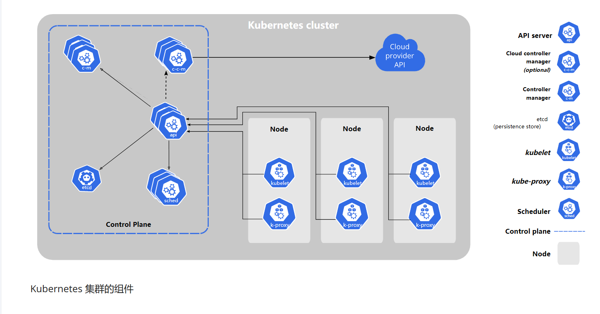
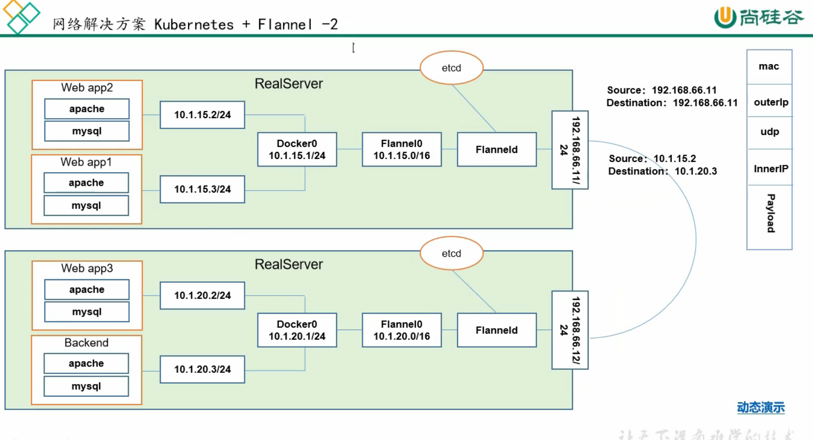
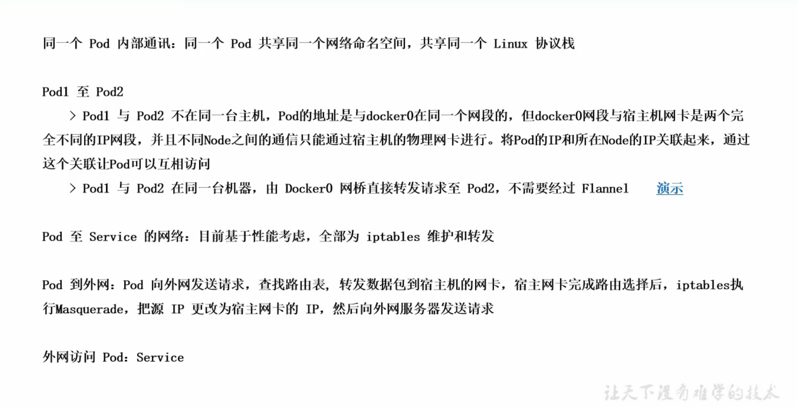

# K8S 学习

## 架构

> Master 节点包含的组件

1. Api Server：所有组件访问统一入口
2. Replication Controller：维持副本期望数目
3. Scheduler：负责介绍任务，选择合适的节点进行任务分配
4. Etcd：分布式键值对数据库，存储 K8S 集群中所有需要持久化的重要信息（故障恢复）

> Node 节点组件

1. Kubelet：直接与容器引擎（例如 Docker）交互以事先容器的生命周期
2. Kube Proxy：负责写入规则至 IpTables 或者 IPVS 中，事先服务映射访问（负载）

> 其它一些组件

1. CoreDNS：可以为集群中的 SVC 创建一个 域名<==>IP 对应关系的解析（负载必须）
2. Dashboard：K8S 集群的控制面板
3. Ingress Controller：K8S 官方只提供了四层代理的实现，Ingress 提供了七层代理的实现
4. Fedetation：提供可以跨集群中心多 K8S 统一管理功能
5. Prometheus：提供 K8S 集群的监控能力
6. ELK：提供 K8S 集群日志统一分析接入平台

## Pod 概念

一个 `Pod` 中会有一个或多个容器，只要有一个 `Pod` 就户籍存在一个 `pause` 容器。同一个 `Pod` 里面共享网络和存储卷（同一个 `Pod` 里面两个容器相互访问使用 `localhost:port` 即可）。

> 服务发现

`Pod` 外部通过 `Service` 来统一访问一组 `Pod`，要求这组 `Pod` 具有相同的选择标签。`Service` 通过 `Round Rubbin` 轮询算法来将外部访问路由到一组 `Pod` 中的一个上面。

## 网络通讯

`Kubernetes` 的网络模型假定了所有的 `Pod` 都在一个可以直接连通的扁平化网络空间（相互之间直接使用集群 `ip` 访问）。

同一个 `Pod` 内多个容器间通过公用 `Pod` 内的 `Pause` 容器的网络栈直接 `localhost` 访问。
各个 `Pod` 之间通过 `Flannel` 服务组件建立一个 `Overlay Network`（覆盖网络） 相互访问。

192.168.1.1
root/koolshare

集群网段使用 192.168.101.0/24 
master-->10
node01-->20
node02-->21

