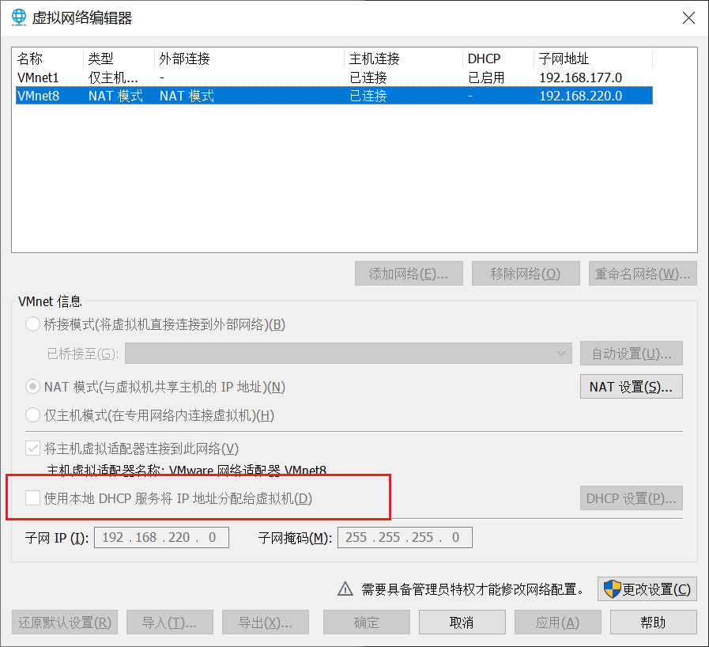
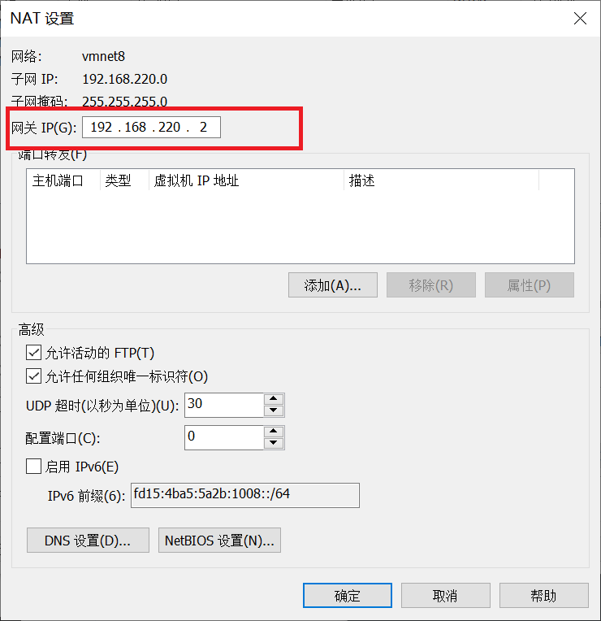
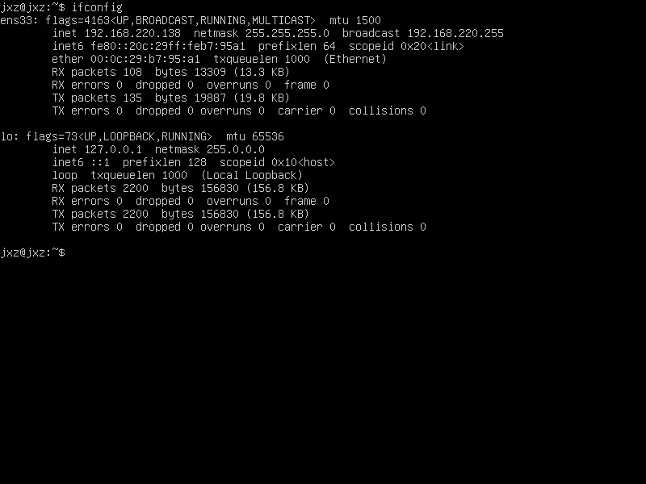
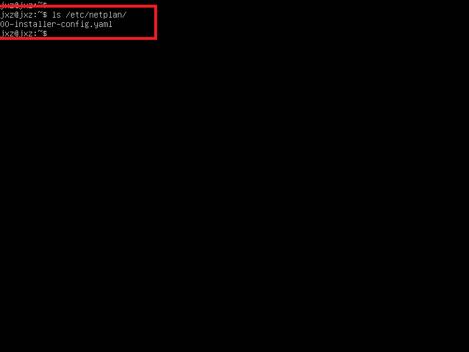
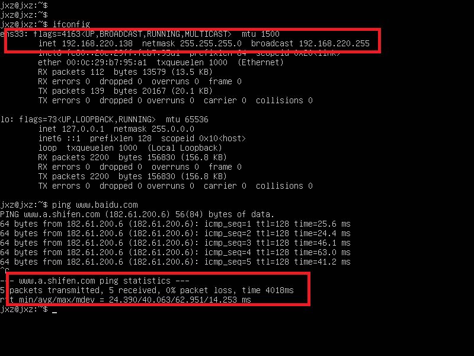

# Vmware Ubuntu 设置静态 IP

> 注意，做了此修改折后，如果进入一个虚拟机中（ubuntu）如果不手动设置 ip，则这个虚拟机就不会分配到 ip，也就无法联网。

1. #### VMware：编辑 -> 虚拟网络编辑器 -> 更改设置

2. #### 取消选中：使用本地DHCP服务将IP地址分配给虚拟机，并记住子网ip（192.168.220.0）

   

3. #### 点击NAT设置，记住网关地址（192.168.220.2）

   

4. 启动虚拟机，进入 ubuntu，记住网卡名称（ens33）

   

5. #### 配置静态IP

   > 注意：Ubuntu18固定IP的方式跟Ubuntu18之前版本的的配置方式不同，Ubuntu18之前在/etc/network/interfaces进行配置，Ubuntu18及之后版本在/etc/netplan/*.yaml进行配置，如/etc/netplan/01-network-manager-all.yaml，如果/etc/netplan目录下没有yml文件，则可以新建一个。

   ```shell
   ls /etc/netplan/
   # 这里已存在 00-installer-config.yml
   ```

   

   ```shell
   sudo vim /etc/netplan/00-installer-config.yml
   ```

   ```yaml
   network:
     version: 2
     ethernets:
       ens33:  # 网卡名称
         dhcp4: no
         dhcp6: no
         addresses: [192.168.220.138/24]  # 本机ip及掩码，最后一段不要取1或2
         gateway4: 192.168.220.2 # 前面记录的网关地址
         nameservers:
           addresses: [192.168.220.2]  # DNS跟随网关地址一致，也可以改别的，如[114.114.114.114,8.8.8.8]
   ```

6. #### 应用更改

   ```shell
   sudo netplan apply
   ```

7. #### 查看是否配置成功

   ```shell
   ifconfig
   ping www.baidu.com
   ```

   