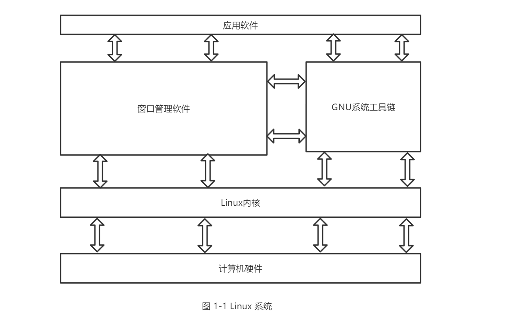
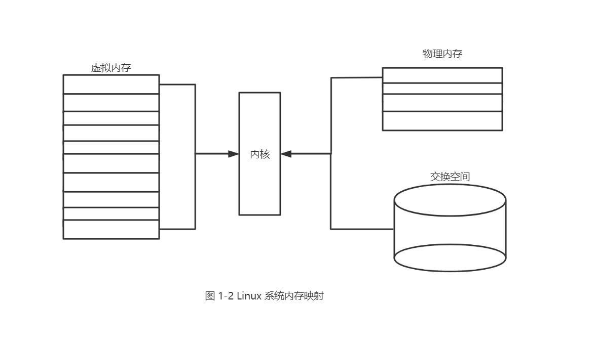

# 第 1 章 初识 Linux Shell

## 本章内容

- [ ] 什么是 Linux
- [ ] Linux 内核的组成
- [ ] 探索 Linux 桌面
- [ ] 了解 Linux 发行版

在深入研究如何使用 Linux 命令行和 shell 之前，最好先了解一下什么是 Linux、它的历史及运作方式。本章将逐步带你了解什么是 Linux，并介绍命令行和 shell 在 Linux 整体架构中的位置。

## 1.1 什么是 Linux

如果你以前从未接触过 Linux，可能就不清楚为什么会有这么多不同版本的 Linux 发行版。在查看 Linux 软件版时，你肯定被发行版、LiveCD 和 GNU 之类的术语搞晕过。初次进入 Linux 世界会让人觉得不那么得心应手。在学习命令行和脚本之前，本章将为你稍稍揭开 Linux 系统的神秘面纱。

首先，Linux 可划分为以下四部分：

- [ ] Linux 内核
- [ ] GNU 工具
- [ ] 图形化桌面环境
- [ ] 应用软件

每一部分在 Linux 系统中各司其职。但就单个部分而言，其作用并不大。图 1-1 是一个基本结构框图，展示各个部分是如何协作起来构成整个 Linux 系统的。

### 1.1.1 深入探究 Linux 内核

Linux 系统的核心是内核。内核控制着计算机系统上的所有硬件和软件，在必要时分配硬件，并根据需要执行软件。

如果你一直都在关注 Linux 世界，肯定听说过 Linus Torvalds。Linus 还在赫尔辛基大学上学时就开发了第一版 Linux 内核。起初他只想仿造一款 Unix 系统而已，因为当时 Unix 操作系统在很多大学都很流行。

Linus 完成了开发工作后，将 Linux 系统发布到了互联网社区，并征求改进意见。这个简单的举动引发了计算机操作系统领域内的一场革命。很快，Linus 就收到了来自世界各地的学生和专业程序员的各种建议。

如果谁都可以修改内核程序代码，那么随之而来的将是彻底的混乱。为了简单起见，Linus 担当起了所有改进建议的把官员。能否将建议代码并入内核完全取决于 Linus。时至今日，这种概念依然在 Linux 内核代码开发过程中沿用，不同的是，现在是由一组开发人员来做这件事，而不是 Linus 一个人。

内核主要负责以下四种功能：

- [ ] 系统内存管理
- [ ] 软件程序管理
- [ ] 硬件设备管理
- [ ] 文件系统管理

后面几节将会进一步探究以上每一种功能。

#### 1. 系统内存管理

操作系统内核的主要功能之一就是内存管理。内核不仅管理服务器上的可用物理内存，还可以创建和管理虚拟内存（即实际并不存在的内存）。

内核通过硬盘上的存储空间来实现虚拟内存，这块空间成为交换空间（swap space）。内核不断地在交换空间和实际的物理内存之间反复交换虚拟内存中的内容。这使得系统以为它拥有比物理内存更多的可用内存（如图 1-2 所示）。

内存存储单元按组划分成很多块，这些块称作页面（page）。内核将每个内存页面放在物理内存或交换空间。然后，内核会维护一个内存页面表，指明哪些页面位于物理内存内，哪些页面被换到了磁盘上。

内核会记录哪些内存页面正在使用中，并自动把一段时间内未使用的内存页面复制到交换区域（称为换出，swapping out）——即使还有可用内存。当程序要访问一个已被换出的内存页面时，内核必须从物理内存换出另外一个内存页面给它让出空间，然后从交换空间换入请求的内存页面。显然，这个过程要花费时间，拖慢运行中的进程。只要 Linux 系统在运行，为运行中的程序换出内存页面的过程就不会停歇。

#### 2. 软件程序管理

Linux 操作系统将运行中的程序称为进程。进程可以在前台运行，将输出显示在屏幕上，也可以在后台运行，隐藏到幕后。内核控制着 Linux 系统如何管理运行在系统上的所有进程。

内核创建了第一个进程（称为 init 进程）来启动系统上所有其它进程。当内核启动时，它会将 init 进程加载到虚拟内存中。内核在启动任何其它进程时，都会在虚拟内存中给新进程分配一块转悠区域来存储该进程用到的数据和代码。

一些 Linux 发行版使用一个表来管理在系统开机时要自动启动的进程。在 Linux 系统上，这个表通常位于专门文件 /etc/inittab 中。

另外一些系统（比如现在流行的 Ubuntu Linux 发行版）则采用 /etc/init.d 目录，将开机时启动或停止某个应用的脚本放在这个目录下。这些脚本通过 /etc/rcX.d 目录下的入口（entry）[^1]启动，这里的 X 代表运行级（run level）。

[^1]: 这些入口实际上是到 /etc/init.d 目录中启动脚本的符号链接。

Linux 操作系统的 init 系统采用了运行级。运行级决定了 init 进程运行 /etc/inittab 文件或 /etc/rcX.d 目录中定义好的某些特定类型的进程。Linux 操作系统有 5 个启动运行级。

运行级为 1 时，只启动基本的系统进程以及一个控制台终端进程。我们称之为单用户模式。
单用户模式通常用了来在系统有问题时进行紧急的文件系统维护。显然，在这种模式下，仅有一个（通常是系统管理员）能登录到系统上操作数据。

标准的启动运行级是 3.在这个运行级上，大多数应用软件，比如网络支持程序，都会启动。另一个 Linux 中常见的运行级是 5。在这个运行级上系统会启动图形化的 X Window 系统，允许用户通过图形化桌面窗口登录系统。

Linux 系统可以通过调整启动运行级来控制整个系统的功能。通过将运行级从 3 调整成 5，系统就可以从基于控制台的系统变成更先进的图形化 X Window 系统。

在第 4 章，你将会学习如何使用 ps 命令查看当前运行在 Linux 系统上的进程。

#### 3. 硬件设备管理

内核的另一个职责是管理硬件设备。任何 Linux 系统需要与之通信的设备，都需要在内核代码中加入其驱动程序代码。驱动程序代码相当于应用程序和硬件设备的中间人，允许内核与设备之间交换数据。在 Linux 内核中有两种方法用于插入设备驱动代码：

- [ ] 编译进内核的设备驱动代码
- [ ] 可插入内核的设备驱动模块

以前，插入设备驱动代码的唯一途径是重新编译内核。每次给系统添加新设备，都需要重新编译一遍内核代码。随着 Linux 内核支持的硬件设备越来越多，这个过程变得越来越低效。不过好在 Linux 开发人员设计出了一种更好的将驱动代码插入运行中的内核的方法。

开发人员提出了内核模块的概念。它允许将驱动代码插入到运行中的内核而无需重新编译内核。同时，当设备不再使用时也可以将内核模块从内核中移走。这种方式极大地简化和扩展了硬件设备在 Linux 上的使用。

Linux 系统将硬件设备当成特殊的文件，称为设备文件。设备文件有 3 中分类：

- [ ] 字符型设备文件
- [ ] 块设备文件
- [ ] 网络设备文件

字符型设备文件是指处理数据时每次只能处理一个字符的设备。大多数类型的调制解调器和终端都是作为字符型设备文件创建的。块设备文件是指处理数据时每次能处理大块数据的设备，比如硬盘。

网络设备文件是指采用数据包发送和接收数据的设备，包括各种网卡和一个特殊的回环设备。这个回环设备允许 Linux 系统使用常见的网络编程协议同自身通信。

Linux 为系统上的每个设备都创建一种称为节点的特殊文件。与设备的所有通信都通过设备节点完成。每个节点都有唯一的数值对供 Linux 内核标识它。数值对包含一个主设备号和一个次设备号。类似的设备被划分到同样的主设备号下。次设备号用于标识主设备组下的某个特定设备。

#### 4. 文件系统管理

不同于其它一些操作系统，Linux 内核支持通过不同类型的文件系统从硬盘中读写数据。除了自有的诸多文件系统外，Linux 还支持从其它操作系统（比如 Microsoft Windows）采用的文件系统中读写数据。内核必须在编译时就加入对所有可能用到的文件系统的支持。表 1-1 列出了 Linux 系统用来读写数据的标准文件系统。

表 1-1 Linux 文件系统

| 文件系统 | 描述                                                |
| :------- | :-------------------------------------------------- |
| ext      | Linux 系统扩展文件系统，最早的 Linux 文件系统       |
| ext2     | 第二文件扩展系统，在 ext 的基础上提供了更多的功能   |
| ext3     | 第三扩展文件系统，支持日志功能                      |
| ext4     | 第四扩展文件系统，支持高级日志功能                  |
| hpfs     | OS/2 高性能文件系统                                 |
| jfs      | IBM 日志文件系统                                    |
| iso9660  | ISO 9660 文件系统（CD-ROM）                         |
| minix    | MINIX 文件系统                                      |
| msdos    | 微软的 FAT16                                        |
| ncp      | Netware 文件系统                                    |
| nfs      | 网络文件系统                                        |
| ntfs     | 支持 Microsoft NT 文件系统                          |
| proc     | 访问系统信息                                        |
| ReiserFS | 高级 Linux 系统文件，能提供更好的性能和硬盘恢复功能 |
| smb      | 支持网络访问的 Samba SMB 文件系统                   |
| sysv     | 较早期的 Unix 文件系统                              |
| ufs      | BSD 文件系统                                        |
| umsdos   | 建立在 msdos 上的类 Unix 文件系统                   |
| vfat     | Windows 95 文件系统（FAT32）                        |
| XFS      | 高性能 64 位日志文件系统                            |

Linux 服务器所访问的所有硬盘都必须格式化成表 1-1 所列文件系统类型中的一种。

Linux 内核采用虚拟文件系统（Virtual File System，VFS）作为和每个文件系统交互的接口。这为 Linux 内核同任何类型文件系统通信提供了一个标准接口。当每个文件系统都被挂在和使用时，VFS 将信息都存在内存中。

### 1.1.2 GNU 工具

除了由内核控制硬件设备外操作系统还需要工具来执行一些标准功能，比如控制文件和程序。Linus 在创建 Linux 系统内核时，并没有任何可用的系统工具。然而他很幸运，就在开发 Linux 内核的同时，有一群人正在互联网上共同努力，模仿 Unix 操作系统开发一系列标准的计算机系统工具。

GNU 组织（GUN 是 GNU's Not Unix 的缩写）开发了一整套完整的 Unix 工具，但没有可以运行它的内核系统。这些工具实在名为开源软件（open source software，OSS）的软件理念下开发的。

开源软件理念允许程序员开发软件，并将其免费发布。任何人都可以使用、修改该软件，或将该软件集成进自己的系统，无需支付任何授权费用。将 Linus 的 Linux 内核和 GNU 操作系统工具结合起来，就产生了一款完整的、功能丰富的免费操作系统。

尽管通常将 Linux 内核和 GNU 工具的结合体称为 Linux，但你也会在互联网上看到一些 Linux 纯粹主义者将其称为 GNU/Linux 系统，藉此想 GNU 组织所做的贡献致意。

#### 1. 核心 GNU 工具

GNU 项目的主旨在于位 Unix 系统管理员设计出一套类似于 Unix 的环境。这个目标促使该项目移植了很多常见的 Unix 系统命令行工具。供 Linux 系统使用的这组核心工具被称为 coreutils（core utilities）软件包。

GNU coreutils 软件包由三部分组成：

- [ ] 用以处理文件的工具
- [ ] 用以操作文本的工具
- [ ] 用以管理进程的工具

这三组主要工具中的每一组都包含一些对 Linux 系统管理员和程序员至关重要的工具。本书将详细介绍 GNU coreutils 软件包中包含的所有工具。

#### 2. shell

GNU/Linux shell 是一种特殊的交互式工具。它为用户提供了启动程序、管理文件系统中的文件以及运行在 Linux 系统上的进程的途径。shell 的核心是命令行提示符。命令行提示符是 shell 负责交互的部分。它允许你输入文本命令，然后解释命令，并在内核中执行。

shell 包含了一组内部命令，用这些命令可以完成诸如复制文件、移动文件、重命名文件、显示和终止系统中正运行的程序等操作。shell 也允许你在命令行提示符中输入程序名称，它会将程序名传递给内核以启动它。

你也可以将多个 shell 命令放入文件中作为程序执行。这些文件被称作 shell 脚本。你在命令行上执行的任何命令都可以放进一个 shell 脚本中作为一组命令执行。这为创建那种需要把几个命令放在一起来工作的工具提供了便利。

在 Linux 系统上，通常有好几个 Linux shell 可用。不同的 shell 有不同的特性，有些更利于创建脚本，有些则更利于管理进程。所有 Linux 发行版默认的 shell 都是 bash shell。bash shell 由 GNU 项目开发，被当作标准 Unix shell——Bourne shell（以创建者的名字命名）的替代品。bash shell 的名称就是针对 Bourne shell 的拼写所玩的一个文字游戏，称为 Bourne again shell。

除了 bash shell，本书还将介绍其它几种常见的 shell。表 1-2 列出了 Linux 中常见的几种不同的 shell。

| shell | 描述                                                                                               |
| :---- | :------------------------------------------------------------------------------------------------- |
| ash   | 一种运行在内存 受限环境中简单的轻量级 shell，但与 bash shell 完全兼容                              |
| korn  | 一种与 Bourne shell 兼容的编程 shell，但支持如关联数组和浮点运算等一些高级的编程特性               |
| tcsh  | 一种将 C 语言中的一些元素引入到 shell 脚本中的 shell                                               |
| zsh   | 一种结合了 bash、tcsh 和 korn 的特性，同时提供高级编程特性、共享历史文件和主题化提示符的高级 shell |

### 1.1.3 Linux 桌面环境

在 Linux 的早期（20 世纪 90 年代初期），能用的只有一个简单的 Linux 操作系统文本界面。这个文本界面允许系统管理员运行程序，控制程序的执行，以及在系统中移动文件。

随着 Microsoft Windows 的普及，电脑用户已经不再满足于对着老式的文本界面工作了。这推动了 OSS 社区的更多开发活动，Linux 图形化桌面环境应运而生。

完成工作的方式不止一种，Linux 一直以来都以此而闻名。在图形化桌面上更是如此。Linux 有各种图形化桌面可供选择。后面几节将会介绍其中一些比较流行的桌面。

#### 1. X Window 系统

有两个基本要素决定了视频环境：显卡和显示器。要在电脑上显示绚丽的画面，Linux 软件就得知道如何与这两者互通。X Window 软件是图形显示的核心部分。

X Window 软件是直接和 PC 上的显卡及显示器打交道的底层程序。它控制着 Linux 程序如何在电脑上显示出漂亮的窗口和图形。

Linux 并非唯一使用 X Window 的操作系统，它有针对不同操作系统的版本。在 Linux 世界里，能够实现 X Window 的软件包可不止一种。

其中最流行的软件包是`X.org`。它提供了 X Window 系统的开源实现，支持当前市面上的很多新显卡。

另外两个 X Window 软件包也日渐流行。Fedora Linux 发行版采用了试验性的 Wayland 软件；Ubuntu Linux 发行版开发出了 Mir 显示服务器，用于其桌面环境。

在首次安装 Linux 发行版时，它会检测显卡和显示器，然后创建一个含有必要信息的 X Window 配置文件。在安装过程中，你可能会注意到安装程序检测一次显示器，以此来确定所支持的视屏模式。有时这会造成显示器黑屏几秒。由于现在有多种不同类型的显卡和显示器，这个过程可能会需要一段时间来完成。

核心的 X Window 软件可以产生图形化显示环境，但仅此而已。虽然对于运行独立的应用这已足够，但在日常 PC 使用中却并不是那么有用。它没有桌面环境供用户操作文件或是开启程序。为此，你需要一个建立在 X Window 系统软件之上的桌面环境。

#### 2. KDE 桌面

KDE（K Desktop Environment，K 桌面环境）最初于 1996 年作为开源项目发布。它会生成一个类似于 Microsoft Windows 的图形化桌面环境。如果你是 Windows 用户，KDE 就继承了所有你熟悉的功能。

KDE 桌面允许你把应用程序图标和文件图标放置在桌面的特定位置上。单击应用程序图标，Linux 系统就会运行该程序。单击文件图标，KDE 桌面就会确定使用哪种应用程序来处理该文件。

桌面底部的横条称为面板，由以下四部分构成。

- [ ] **KDE 菜单**：和 Windows 的开始菜单非常类似，KDE 菜单包含了启动已安装程序的链接。
- [ ] **程序快捷方式**：在面板上有直接从面板启动程序的快速链接。
- [ ] **任务栏**：任务栏显示着当前桌面正在运行的程序的图标。
- [ ] **小应用程序**：面板上还有一些特殊小应用程序的图标，这些图标通常会根据小应用程序的状态发生变化。

所有的面板功能都和你在 Windows 上看到的 类似。除了桌面功能，KDE 项目还开发了大量的可运行在 KDE 环境中的应用程序。

#### 3. GNOME 桌面

GNOME（the GNU Network Objects Model Environment，GNU 网络对象模型环境）是另一个流行的 LInux 桌面环境。GNOME 于 1999 年首次发布，现已成为许多 Linux 发行版的默认桌面环境（不过用的最多的是 Red Hat Linux）。

尽管 GNOME 决定不再沿用 Microsoft Windows 的标准观感（look-and-feel），但它还是集成了许多 Windows 用户习惯的功能：

- [ ] 一块放置图标的桌面区域
- [ ] 两个面板区域
- [ ] 拖放功能

GNOME 开发人员不甘示弱于 KDE，也开发了一批集成进 GNOME 桌面的图形化程序。

#### 4. Unity 桌面

如果你用的是 Ubuntu Linux 发行版，你会注意到它与 KDE 和 GNOME 桌面环境有些不一样。准确来说，这是因为负责开发 Ubuntu 的公司决定采用自己的一套叫做 Unity 的 Linux 桌面环境。

Unity 桌面得名于该项目目标——为工作站、平板电脑以及移动设备提供一致的桌面体验。不管你是在工作站还是在手机上使用 Ubuntu，Unity 桌面的使用都是一样的。

#### 5. 其它桌面

图形化桌面环境的弊端在于它们需要占用相当一部分的系统资源来保证正常运行。在 Linux 发展之初，Linux 的标志和卖点之一就是它可以运行在处理能力较弱的老旧 PC 上，这些 PC 无力运行较新的微软桌面。然而随着 KDE 和 GNOME 桌面环境的普及，情况发生了变化。运行 KDE 或 GNOME 桌面要占用的内存资源和微软的最新桌面环境旗鼓相当。

如果你的 PC 已经有些年代了，也不要泄气。Linux 开发人员已经联手让 Linux 返璞归真。他们开发了一些低内存开销的图形化桌面应用，提供了能够在老旧 PC 上完美运行的基本功能。尽管这些图形化桌面环境并没有大量专为其设计的应用，但它们仍然能运行许多基本的图形化程序，支持如文字处理、电子表格、数据库、绘图以及多媒体等功能。

表 1-3 列出了一些可在配置较低的 PC 和笔记本电脑上运行的轻量级 Linux 图形化桌面环境。

表1-3 其它Linux图形化桌面

| 桌面    | 描述                                                                                  |
| :------ | :------------------------------------------------------------------------------------ |
| Fluxbox | 一个 没有面板的轻量级桌面 ，仅有一个可用来 启动程序的弹出式菜单                       |
| Xfce    | 和 KDE 很像的一个桌面，但少了很多图像以适应低内存环境                                 |
| JWM     | Joe 的窗口管理器（Joe's Windows Manager），非常适用于低内存低硬盘空间环境的超轻型桌面 |
| Fvwm    | 支持如虚拟桌面和面板等高级桌面功能，但能够在低内存环境中运行                          |
| fvwm95  | 从 fvwm 衍生而来，但看起来更像是 Windows 95 桌面                                      |

这些图形化桌面环境并不如 KDE 或 GNOME 桌面一样绚丽，但却提供了恰到好处的基本图形化功能。

如果你用的是老旧 PC，尝试一下基于上述某个桌面环境的 Linux 发行版，看看怎么样，可能会有惊喜哦。

## 1.2 Linux 发行版

到此为止，你已经了解了构成完整 Linux 系统所需要的 4 个关键部件，那你可能在考虑要怎样才能把它们组成一个 Linuxx 系统。幸运的是，已经有人为你做好好了这些。

我们将完整的 Linux 系统包称为发行版。有很多不同的 Linux 发行版来满足可能存在的各种运算需求。大多数发行版是为某个特定用户群定制的，比如商业用户、多媒体爱好者、软件开发人员或普通家庭用户。每个定制的发行版都包含了支持特定功能所需的各种软件包，比如为多媒体爱好者准备的音频和视频编辑软件，为软件开发人员准备的编译器和集成开发环境（IDE）。

不同的 Linux 发行版通常归类为 3 种：

- [ ] 完整的核心 Linux 发行版
- [ ] 特定用途的发行版
- [ ] LiveCD 测试发行版

后面几节将会探讨这些不同类型的 Linux 发行版，然后展示每种类型中一些 Linux 发行版示例。

### 1.2.1 核心 Linux 发行版

核心 Linux 发行版含有内核、一个或多个图形化桌面环境以及预编译好的几乎所有能见到的 Linux 应用。它提供了一站式的完整 Linux 安装。表 1-4 列出了一些较流行的和兴 Linux 发行版。

表1-4 核心Linux发行版

| 发行版    | 描述                                                 |
| :-------- | :--------------------------------------------------- |
| Slackware | 最早的 Linux 发行版中的一员，在 Linux 极客中比较流行 |
| Red Hat   | 主要用于 Internet 服务器的商业发行版                 |
| Fedora    | 从 Red Hat 分离出来的家用发行版                      |
| Gentoo    | 为高级 Linux 用户设计的发行版仅包含 Linux 源码       |
| openSUSE  | 用于商用和家用的发行版                               |
| Debian    | 在 Linux 专家和商用 Linux 产品中流行的发行版         |

在 Linux 的早期，发行版是作为一叠软盘发布的。你必须下载多组文件，然后将其复制到软盘上。通常需要 20 张或更多的软盘来创建一个完整的发行版！毋庸多言，这是个痛苦的过程。

现今，家用电脑基本都有内置的 CD 和 DVD 光驱，Linux 也就用一组 CD 光盘或单张 DVD 光盘来发布。这大大简化了 Linux 的安装过程。

然而当新手安装核心 Linux 发行版时，任然遇到各种各样的问题。为了照顾到 Linux 用户的所有的使用场景，单个发行版必须包含很多应用软件。从高端的 Internet 数据库服务器到常见的游戏，可谓应有尽有。鉴于 Linux 上可用应用程序的数量，一个完整的发行版通常至少需要 4 张 CD。

尽管发行版中的大量可选配置对 Linux 极客来说时好事，但对于新手来说就是一场噩梦。多数发行版会在安装过程中询问一些列问题，以决定哪些应用要默认加载、PC 上连接了哪些硬件以及怎样配置硬件设备。新手经常会被这些问题困扰，因此，他们经常是要么加载了过多的程序，要么没有加载够，到后来才发现计算机没有按照他们预想的方式工作。

对于新手来说，幸运的是，安装 Linux 还有更简便的方法。

### 1.2.2 特定用途的 Linux 发行版

Linux 发行版的一个新子群已经出现了。它们通常基于某个主流发行版，但仅包含主流发行版中一小部分用于特定用途的程序。

除了提供特定软件外（比如仅为商业用户提供的办公应用），定制化发行版还尝试通过自动检测和自动配置常见硬件来帮助新手安装 Linux。这使得 Linux 的安装过程轻松愉悦了很多。

表 1-5 列出了一些特定用途的 Linux 发行版以及它们的特长

表1-5 特定用途的Linux发行版

| 发行版      | 描述                                                 |
| :---------- | :--------------------------------------------------- |
| CentOS      | 一款基于 Red Hat 企业版 Linux 源代码构建的免费发行版 |
| Ubuntu      | 一款用于学校和家庭的免费发行版                       |
| PCLinuxOS   | 一款用于家庭和办公的免费发行版                       |
| Mint        | 一款用于家庭娱乐的免费发行版                         |
| dyne:bolic  | 一款用于音频和 MIDI 的免费发行版                     |
| Puppy Linux | 一款适用于老旧 PC 的免费发行版                       |

这只是特定用途的 Linux 发行版中的一小部分而已。像这样的发行版足有上百款，而且在互联网上还不断有新的成员加入。不干你的专场是什么，你都能找到一款为你量身定做的 Linux 发行版。

许多特定用途的 Linux 发行版都是基于 Debian Linux。它们使用和 Debian 一样的安装文件，但仅打包了完整 Debian 系统中的一小部分。

### 1.2.3 Linux LiveCD

Linux 世界中一个相对较新的现象是可引导的 Linux CD 发行版的出现。它无需安装就可以看到 Linux 是什么样的。多数现代 PC 都能从 CD 启动，而不是必须从标准硬盘启动。基于这点，一些 Linux 发行版创建了含有 Linux 样本系统（称为 Linux LiveCD）的可引导 CD。由于单张 CD 容量的限制，这个样本并未完整的 Linux 系统，不过令人惊喜的是，你可以自己加入各种软件。结果就是，你可以通过 CD 来启动 PC，并且无需在硬盘上安装任何东西就能运行 Linux 发行版。

这是一个不弄乱 PC 就能体验各种 Linux 发行版的绝妙方法。只需要插入 CD 就能引导了！所有的 Linux 软件都将直接从 CD 上运行。你可以从互联网上下载各种 Linux LiveCD，刻录，然后体验。

表 1-6 列出了一些可用的流行 Linux LiveCD

表1-6 Linux LiveCD 发行版

| 发行版      | 描述                                                 |
| :---------- | :--------------------------------------------------- |
| Knoppix     | 来自德国的一款 Linux 发行版，也是最早的 Linux LiveCD |
| PCLinucOS   | 一款成熟的 LiveCD 形式的 Linux 发行版                |
| Ubuntu      | 为多种语言设计的世界级 Linux 项目                    |
| Slax        | 基于 Slackware Linux 的一款 LiveCD Linux             |
| Puppy Linux | 为老旧 PC 设计的一款全功能 Linuxx                    |

你能在这张表中看到熟悉的面孔。许多特定用途的 Linux 发行版都有对应的 Linux LiveCD 版本。一些 Linux LiveCD 发行版，比如 Ubuntu，允许直接从 LiveCD 安装整个发行版。这使你可以从 CD 引导启动，先体验一下此 Linux 发行版，如果喜欢的话，再把它安装到硬盘上。这个功能及其方便易用。

就像所有美好的事物一样，Linux LiveCD 也有一些不足之处。由于要从 CD 上访问所有东西，应用程序会运行得更慢，而如果再搭配上陈旧缓慢的 PC 和光驱，那更是慢上加慢。还有，由于无法向 CD 写入数据，对 Linux 的任何修改都会在重启后失效。

不过，有一些 Linux LiveCD 的改进帮助解决了上述一些问题。这些改进包括：

- [ ] 能将 CD 上的 Linux 系统复制到内存中
- [ ] 能将系统文件复制到硬盘上
- [ ] 能在 U 盘上存储系统设置
- [ ] 能在 U 盘上存储用户设置

一些 Linux LiveCD，如 Puppy Linux，只包含了最少数量的 Linux 系统文件。当 CD 引导启动时，LiveCD 的脚本直接将它们复制到内存中。这允许在 Linux 启动后立即把 CD 从光驱中取走。这不仅提高了程序运行速度（因为程序从内存中运行时更快）
，而且还空出了 CD 光驱，供你用 Puppy Linux 自带的软件转录音频 CD 或播放视频 DVD。

其它 Linux LiveCD 用另外的方法，同样允许你在启动后将 CD 从光驱中拿走。这种方法是将核心 Linux 文件作为文件复制到 Windows 硬盘上。待 CD 启动后，系统会寻找那个文件，并从中读取系统文件。dyne:bolic Linux LiveCD 采用的就是这种技术，我们称之为对接。当然，你必须在从 CD 引导启动之前把系统文件复制到硬盘里。

一种非常流行的技术就是用常见的 U 盘（也称为闪存或闪盘）来存储 Linux LiveCD 会话数据。几乎每个 Linux LiveCD 都能识别插入的 U 盘（即使是在 Windows 下格式化的）并从 U 盘上读写文件。这允许你启动 Linux LiveCD，使用 Linux 应用来创建文件，再将这些文件存储在 U 盘上，然后用 Windows 应用（或者在另外一台电脑上）访问这些文件。这该有多酷！

## 1.3 小结

本章探讨了 Linux 系统及其基本工作原理。Linux 内核是系统的核心，控制着内存、程序和硬件之间的交互。GNU 工具也是 Linux 系统中的一个重要部分。本书关注的焦点 Linux shell 是 GNU 核心工具集中的一部分。本章还讨论了 Linux 系统中的最后一个组件：Linux 桌面环境。随着时间推移，一切都发生了改变。现今的 Linux 可以支持多种图形化桌面环境。

本章还探讨了各种 Linux 发行版。Linux 发行版就是把 Linux 系统的各个不同部分汇集起来组成一个易于安装的包。Linux 发行版有囊括各种软件的成熟的 Linux 发行版，也有只包含针对某种特定功能软件包的特定用户图发行版。Linux LiveCD 则是一种无需将 Linux 安装到硬盘上就能体验 Linux 的发行版。

下一张将开始了解启动命令行和 shell 脚本编程体验所需的基本知识。你将了解如何从绚丽的图形化桌面环境获得 Linux shell 工具。就目前而言，这绝非易事。
